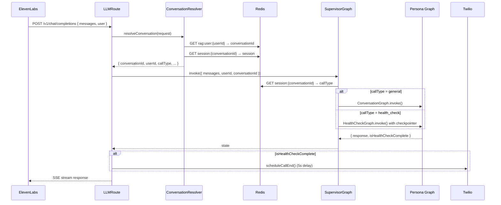
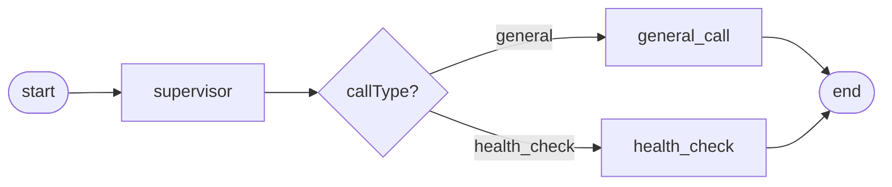
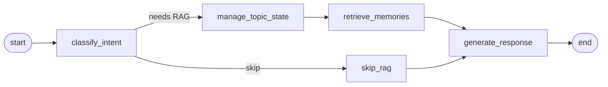
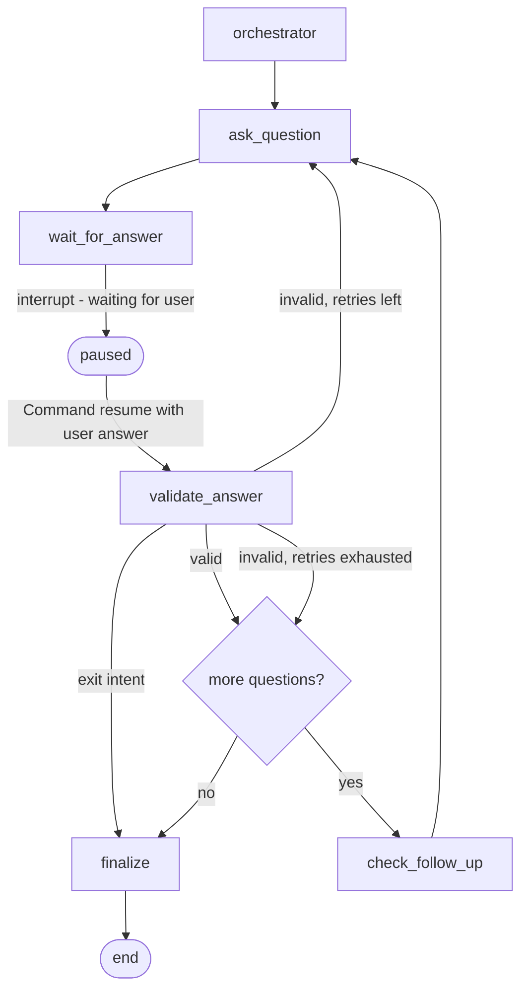

# @naiber/llm-server — AI Orchestration Layer

`@naiber/llm-server` (port 3001) handles all LLM orchestration. It exposes an OpenAI-compatible endpoint that ElevenLabs calls directly for each conversation turn, and a BullMQ worker that processes post-call jobs dispatched by `@naiber/server`.

`llm-server` never communicates with `server` directly — it is called by ElevenLabs and consumes Redis session data written by `server`.

For the full end-to-end picture see `docs/arch/overview.md`. This document goes deep on `llm-server` internals only.

---

## Responsibilities

- Serve `POST /v1/chat/completions` (OpenAI-compatible) for ElevenLabs
- Resolve conversation context from Redis for each incoming request
- Route messages to the correct persona graph via `SupervisorGraph`
- Run the **general conversation** graph with RAG memory retrieval
- Run the **health check** graph with durable interrupt/resume execution
- Process post-call jobs (summarization, embeddings, DB persistence)

**Does NOT own:** Telephony, WebSocket session management, system prompts (those live in `server/src/prompts/`), shared types or clients.

---

## Directory Layout

```
packages/llm-server/src/
├── controllers/
│   └── LLMController.ts                  # Fallback handler when no session context found
├── graphs/
│   └── SupervisorGraph.ts                # Top-level router to persona graphs
├── personas/
│   ├── general/
│   │   ├── ConversationGraph.ts          # Intent → RAG → Response pipeline
│   │   ├── ConversationState.ts          # LangGraph state annotation
│   │   ├── ConversationHandler.ts        # Helper methods (memory injection, etc.)
│   │   └── post-call/
│   │       ├── GeneralPostCallGraph.ts   # Summary, topic extraction, embeddings
│   │       └── PostCallState.ts
│   ├── health/
│   │   ├── HealthCheckGraph.ts           # Durable Q&A loop with checkpointer
│   │   ├── HealthCheckState.ts
│   │   ├── HealthCheckHandler.ts         # Question initialization, validation helpers
│   │   ├── questions/
│   │   │   ├── Question.ts               # Base QuestionData type
│   │   │   ├── ScaleQuestion.ts          # 1–10 scale questions
│   │   │   ├── BooleanQuestion.ts        # Yes/No questions
│   │   │   └── TextQuestion.ts           # Free-text questions
│   │   ├── tools/
│   │   │   └── ValidationTools.ts        # LLM-assisted answer extraction
│   │   └── post-call/
│   │       ├── HealthPostCallGraph.ts    # Persists answers to DB
│   │       └── HealthPostCallState.ts
│   └── cognitive/
│       ├── CognitiveGraph.ts             # Placeholder — no logic
│       ├── CognitiveHandler.ts
│       └── CognitiveState.ts
├── routes/
│   ├── LLMRoute.ts                       # POST /v1/chat/completions
│   ├── StatusRoute.ts                    # GET /status
│   └── BullBoardRoute.ts                 # GET /admin/queues (queue dashboard)
├── services/
│   ├── ConversationResolver.ts           # Extracts session context from incoming requests
│   ├── MemoryRetriever.ts                # Qdrant vector search
│   ├── TopicManager.ts                   # Topic change detection + embedding cache
│   ├── IntentClassifier.ts               # Classifies if message needs RAG
│   └── HealthDataService.ts              # Health-specific data utilities
├── states/
│   └── SupervisorState.ts                # Shared state annotation for supervisor
├── workers/
│   └── PostCallWorker.ts                 # BullMQ consumer for post-call-processing
├── middleware/
│   └── Analytics.ts
└── index.ts                              # Express init, checkpointer setup, worker start
```

---

## Request Lifecycle (Per Turn)



---

## ConversationResolver

`services/ConversationResolver.ts` bridges the gap between an ElevenLabs request (which has an OpenAI-style message array) and the Redis session data written by `server`.

**Resolution order:**
1. Check `request.user` or `request.user_id` field
2. Extract `userId` from system message via regex pattern
3. Extract `phone` from system message
4. Look up `rag:user:{userId}` or `rag:phone:{phone}` in Redis to get `conversationId`
5. Fetch `session:{conversationId}` for full session data

If resolution fails (no session found), `LLMRoute` falls back to `LLMController` — a generic GPT-4o passthrough with no persona context. This is a degraded state, not an error.

**Known gap:** If a Redis session expires mid-call (1h TTL), the resolver will fail to find context and fall back to the generic controller. This silently degrades the call experience.

---

## SupervisorGraph

`graphs/SupervisorGraph.ts` is a LangGraph `StateGraph` that routes messages to the correct persona graph. It does **not** make an LLM call for routing — the call type is already known from the Redis session.



| Node | What it does |
|---|---|
| `supervisor` | Reads `session:{conversationId}` from Redis, sets `callType` in state |
| `route` | Conditional edge — returns `'general_call'` or `'health_check'` |
| `general_call` | Invokes compiled `ConversationGraph`, returns `response` |
| `health_check` | Invokes `HealthCheckGraph` with Redis checkpointer |

**LangGraph convention:** Uses `graph: any` typing and `setEntryPoint()` (not `addEdge(START, ...)`). This is intentional to avoid TypeScript strict type issues with node name literals. See `CLAUDE.md`.

---

## ConversationGraph (General Call)

`personas/general/ConversationGraph.ts` handles the RAG-backed conversation pipeline for general companionship calls.



### Nodes

**`classify_intent`**
Calls `IntentClassifier` to decide if the user's message warrants RAG lookup. Short responses ("yeah", "ok", "that's nice"), pleasantries, and simple continuations are tagged as non-substantive and skip the RAG path. This avoids expensive vector searches on filler turns.

**`manage_topic_state`**
- Generates an embedding for the current user message
- Compares cosine similarity to the cached topic centroid (`rag:topic:{conversationId}`)
- If similarity is below threshold → topic has changed → marks `topicChanged: true`
- Updates the centroid and highlights cache in Redis

**`retrieve_memories`**
- If `topicChanged` or cache is stale: calls `MemoryRetriever.search()` for top-5 similar memories from Qdrant
- Returns `retrievedMemories[]` — strings to inject into the LLM system prompt
- If topic has not changed and cache is fresh: skips the vector search and uses cached highlights

**`skip_rag`**
Sets `shouldProcessRAG: false`. The graph still generates a response, just without memory context.

**`generate_response`**
- Calls GPT-4o with the conversation history
- If memories were retrieved, they are injected under a `RELEVANT MEMORIES` section in the system prompt
- Returns the response string

### RAG flow summary
```
user message → embed → compare to topic centroid
  → if changed: Qdrant vector search (top-5) → inject into prompt
  → if same: use cached highlights → inject into prompt
  → GPT-4o response
```

---

## HealthCheckGraph (Health Check Call)

`personas/health/HealthCheckGraph.ts` runs a structured, multi-turn health check using LangGraph's **interrupt/resume** pattern for durable execution.

### Why durable execution?
A health check asks 8–12 questions across many conversation turns. The graph state (current question index, answers so far, retry count) must survive across turns. Using a Redis checkpointer means this state is persisted between turns without in-memory tracking, and the post-call worker can read answers directly from the checkpoint state.

**Thread ID:** `health_check:{userId}:{conversationId}`
**Checkpointer:** `ShallowRedisSaver` from `@langchain/langgraph-checkpoint-redis/shallow`
**Checkpointer init:** Done in `index.ts`, passed through `LLMRoute` → `SupervisorGraph` → `HealthCheckGraph`

### Graph nodes



| Node | What it does |
|---|---|
| `orchestrator` | First run only: calls `HealthCheckHandler.initializeHealthCheck(userId)` to load the question set. Sets `healthCheckQuestions[]` in state. |
| `ask_question` | Generates a natural-language question string via LLM system prompt. Sets `response`. |
| `wait_for_answer` | **Interrupts the graph.** Pauses execution, returns `response` to ElevenLabs. On next turn, `SupervisorGraph` resumes via `Command({ resume: userAnswer })`. |
| `validate_answer` | Checks if the answer matches the question's expected format (scale, boolean, text). On failure: increments `questionAttempts`. At `MAX_RETRY`: skips question. If exit intent ("stop", "bye", "I don't want to do this") → go to `finalize`. If confused/ambiguous: attempts LLM extraction via `ValidationTools`. |
| `check_follow_up` | Optionally generates a follow-up question based on the answer (max 2 follow-ups per question). |
| `finalize` | Sets `isHealthCheckComplete: true`, generates a closing message. `LLMRoute` detects this flag and schedules a Twilio call end. |

### Question types

All questions are plain JSON (`QuestionData`) — serializable for Redis checkpoint persistence.

| Type | Validation | Example |
|---|---|---|
| `ScaleQuestion` | Integer 1–10 | "How would you rate your energy today?" |
| `BooleanQuestion` | Yes/No | "Did you take your medications this morning?" |
| `TextQuestion` | Non-empty string | "Any other symptoms you'd like to mention?" |

### Thread lifecycle

```
Turn 1: new thread → orchestrator → ask_question → wait_for_answer (interrupt, returns Q1)
Turn 2: resume with answer → validate_answer → ask_question → wait_for_answer (returns Q2)
...
Turn N: final answer → validate → finalize → isHealthCheckComplete = true
Post-call: worker reads checkpoint state → extracts healthCheckAnswers[] → persists to DB → deletes thread
```

---

## PostCallWorker

`workers/PostCallWorker.ts` consumes the `post-call-processing` BullMQ queue dispatched by `server`.

**Concurrency:** 1 (sequential processing)
**Rate limit:** 3 jobs / 60s
**Queue name:** `POST_CALL_QUEUE_NAME` from `@naiber/shared-core`

### Health check post-call

```
1. checkpointer.getTuple({ configurable: { thread_id } }) → read checkpoint state
2. Extract state.values.healthCheckAnswers[]
3. Invoke HealthPostCallGraph → persist answers to DB via HealthRepository
4. checkpointer.delete(thread_id) → clean up Redis checkpoint
```

### General post-call

```
1. Invoke GeneralPostCallGraph:
   a. Create conversation summary → ConversationRepository.createSummary()
   b. Extract topics via NLP (compromise) → ConversationRepository.upsertTopics()
   c. Generate embeddings for memorable content → Qdrant upsert
2. Update RAG vector store for future calls
```

### Shared cleanup (both paths)

`Redis.deleteByPattern('rag:topic:{conversationId}')` — removes in-call topic cache after processing.

---

## Services

| Service | Purpose |
|---|---|
| `ConversationResolver` | Maps incoming ElevenLabs request → Redis session context |
| `IntentClassifier` | Classifies if a message is substantive enough to warrant RAG |
| `TopicManager` | Detects topic shifts via cosine similarity; manages Redis embedding cache |
| `MemoryRetriever` | Qdrant vector search for top-N memories by cosine similarity |
| `HealthDataService` | Health-specific data utilities used by HealthCheckHandler |

---

## Redis Keys Owned by llm-server

| Key | TTL | Value |
|---|---|---|
| `health_check:{userId}:{conversationId}` | checkpoint-managed | LangGraph state blob (questions, answers, index, attempts) |
| `rag:topic:{conversationId}` | variable | `{ centroid: number[], highlights: string[], messageCount: number }` |

> `llm-server` also **reads** `session:{conversationId}`, `rag:user:{userId}`, and `rag:phone:{phone}` — but these are written and owned by `server`.

---

## Environment Variables

| Variable | Purpose |
|---|---|
| `LLM_PORT` | Server port (default `3001`) |
| `OPENAI_API_KEY`, `OPENAI_BASE_URL` | LLM provider for all graph nodes |
| `QDRANT_URL`, `QDRANT_API_KEY`, `QDRANT_COLLECTION` | Vector database for RAG |
| `REDIS_URL` | Redis connection (default `redis://localhost:6379`) |
| `TWILIO_ACCOUNT_SID`, `TWILIO_AUTH_TOKEN`, `TWILIO_NUMBER` | Used by PostCallWorker to schedule call end |
| `ELEVENLABS_API_KEY`, `ELEVENLABS_AGENT_ID`, `ELEVENLABS_BASE_URL`, `ELEVENLABS_NUMBER_ID` | Used by PostCallWorker's ElevenLabs client |
| `RAG_ENABLED` | Toggle RAG feature flag (default `true`, set `'false'` to disable) |
| `RAG_MEMORY_SIMILARITY_THRESHOLD` | Cosine similarity threshold for memory retrieval (default `0.45`) |

---

## Gotchas

- **`@langchain/langgraph-checkpoint` must be pinned to `^1.0.0`** — `^1.0.1` breaks compatibility with `@langchain/langgraph@1.0.1`. Do not upgrade without testing.
- **Checkpointer is initialized in `index.ts`** and passed as a dependency through `LLMRoute` → `SupervisorGraph` → `HealthCheckGraph`. Do not instantiate it inside graph files.
- **Health check has `MAX_RETRY`** — if validation fails too many times, the question is skipped (not retried forever). Unanswered questions appear as `null` in `healthCheckAnswers`.
- **`RAG_ENABLED = 'false'`** (string, not boolean) disables vector search and makes `ConversationGraph` skip the RAG path entirely. Useful for testing or degraded-mode operation.
- **Bull Board at `/admin/queues`** — useful for monitoring and retrying failed jobs during development.
- **PostCallWorker rate limit** — 3 jobs/60s prevents thundering herd if many calls end simultaneously. Jobs queue up and process sequentially.
- **Cognitive persona is a placeholder** — `CognitiveGraph`, `CognitiveHandler`, and `CognitiveState` exist but contain no logic. `SupervisorGraph` does not currently route to it.
