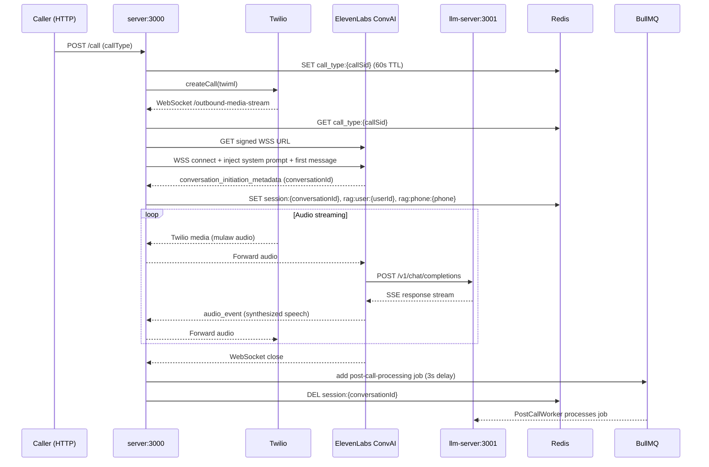
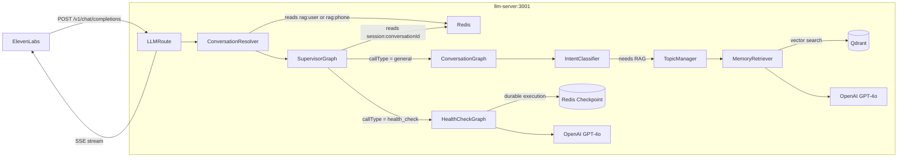
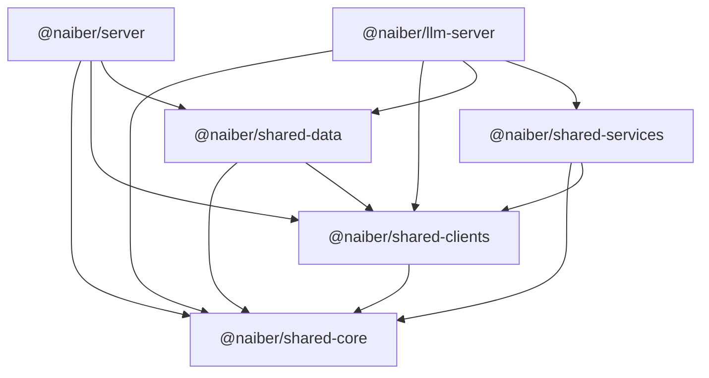

# System Architecture Overview

nAIber is a voice-based AI companion for elderly care. Outbound phone calls are placed via Twilio, audio is streamed through ElevenLabs ConvAI for voice synthesis and turn detection, and LLM orchestration is handled by a separate server running LangGraph persona graphs.

Three call types exist: **general conversation** (companionship), **health check** (structured data collection), and **cognitive assessment** (placeholder — not yet implemented).

---

## Package Map

```
┌─────────────────────────────────────────────────────────┐
│                        Monorepo                          │
│                                                          │
│  @naiber/server (3000)     @naiber/llm-server (3001)    │
│  Telephony layer           AI orchestration layer        │
│                                                          │
│  @naiber/scheduler-server  (scaffold — not active)      │
│                                                          │
│  ──── shared packages ────────────────────────────────  │
│  @naiber/shared-core       Types only (no runtime)      │
│  @naiber/shared-clients    External service wrappers    │
│  @naiber/shared-data       Repositories + Redis stores  │
│  @naiber/shared-services   Business logic utilities     │
└─────────────────────────────────────────────────────────┘
```

| Package | Port | Role |
|---|---|---|
| `@naiber/server` | 3000 | Twilio webhooks, ElevenLabs WSS sessions, BullMQ dispatch |
| `@naiber/llm-server` | 3001 | LangGraph, SupervisorGraph → persona graphs, PostCallWorker |
| `@naiber/scheduler-server` | — | Cron call scheduling (scaffold — not yet active) |
| `@naiber/shared-core` | — | Prisma-derived types, BullMQ queue contracts |
| `@naiber/shared-clients` | — | OpenAI, Twilio, ElevenLabs, Redis, Prisma, Qdrant clients |
| `@naiber/shared-data` | — | UserRepository, ConversationRepository, HealthRepository, RedisEmbeddingStore |
| `@naiber/shared-services` | — | EmbeddingService, TextPreprocessor |

### Build Order

Packages use TypeScript project references (`tsc --build`). Dependencies must build in this order:

```
shared-core → shared-clients → shared-data → shared-services → server / llm-server
```

Run `npm run build` from the repo root.

---

## End-to-End Call Flow



**Key design point:** `server` and `llm-server` are never directly connected. ElevenLabs itself dials `llm-server:3001/v1/chat/completions` using an OpenAI-compatible endpoint — the server only knows about Twilio and ElevenLabs WebSockets.

---

## LLM Message Processing (During Call)



### Routing Logic

`SupervisorGraph` reads `callType` from the Redis session (`session:{conversationId}`) and dispatches accordingly. It does not make an LLM call for routing — the call type is known at session creation time.

### General Call — ConversationGraph

1. **Classify intent** — Skip RAG for short/filler messages (e.g. "yeah", "ok")
2. **Manage topic state** — Embed the user's message, compare cosine similarity to cached topic centroid to detect topic change
3. **Retrieve memories** — If topic changed or cache stale: top-5 vector search via Qdrant
4. **Generate response** — GPT-4o with system prompt + injected memory context

### Health Check — HealthCheckGraph

Uses LangGraph's **interrupt/resume** pattern for durable execution. Each turn the graph either:
- Asks the next question (resumes → interrupt)
- Receives an answer from the user (Command resume → validate → advance or retry)

Thread ID: `health_check:{userId}:{conversationId}`. State is persisted in Redis via `ShallowRedisSaver`. When the check completes, `LLMRoute` schedules a Twilio call end with a 5s delay.

---

## Post-Call Processing

```mermaid
flowchart TD
    BullMQ -->|post-call-processing job| Worker[PostCallWorker]

    Worker -->|callType = health_check| HealthPath
    Worker -->|callType = general| GeneralPath

    subgraph HealthPath[Health Check Post-Call]
        H1[Read checkpoint state] --> H2[Extract healthCheckAnswers]
        H2 --> H3[HealthPostCallGraph → persist to DB]
        H3 --> H4[Delete checkpoint thread]
    end

    subgraph GeneralPath[General Post-Call]
        G1[GeneralPostCallGraph] --> G2[Create conversation summary]
        G2 --> G3[Extract & upsert topics]
        G3 --> G4[Generate embeddings → Qdrant]
    end

    Worker --> Cleanup[Delete rag:topic:{conversationId} from Redis]
```

**Worker constraints:** Concurrency 1, rate-limited to 3 jobs/60s. BullMQ deduplication at the producer prevents duplicate jobs per `conversationId` (5-min in-memory TTL).

---

## Redis Key Patterns

| Key | TTL | Value | Set by | Purpose |
|---|---|---|---|---|
| `call_type:{callSid}` | 60s | `'general'` \| `'health_check'` | server | Passes call type to WebSocket handler |
| `session:{conversationId}` | 1h | `{ callSid, userId, phone, streamSid, startedAt, callType }` | server | Active call session |
| `rag:user:{userId}` | 1h | `conversationId` | server | Maps user → active conversation |
| `rag:phone:{phone}` | 1h | `conversationId` | server | Maps phone → active conversation (fallback lookup) |
| `health_check:{userId}:{conversationId}` | checkpoint-managed | LangGraph state blob | llm-server | Durable health check execution |
| `rag:topic:{conversationId}` | variable | Topic centroid + highlights cache | llm-server | Avoids redundant vector searches mid-call |

---

## Key Design Decisions & Rationale

### ElevenLabs calls llm-server directly
ElevenLabs ConvAI supports custom LLM endpoints via a signed URL. `server` configures this URL when establishing the ElevenLabs WebSocket — ElevenLabs then dials `llm-server:3001/v1/chat/completions` itself for every turn. This means `server` has zero LLM logic and `llm-server` has zero telephony logic. The boundary is clean.

**Trade-off:** `llm-server` cannot push messages to the call (it only responds to ElevenLabs pulls), and debugging requires correlating logs across two services.

### Durable execution for health check
Health checks ask ~8–12 structured questions across multiple conversation turns. Using LangGraph's interrupt/resume pattern with a Redis checkpointer means the graph state (current question index, answers so far, retry count) survives across turns without in-memory state. This also means post-call processing can read answers directly from the checkpoint rather than building a separate answer store.

**Trade-off:** `@langchain/langgraph-checkpoint` must be pinned to `^1.0.0`. Version `^1.0.1` introduces breaking changes incompatible with the installed `@langchain/langgraph@1.0.1`.

### Shared package split (core → clients → data → services)
Each layer has a single responsibility and a strict dependency direction. `shared-core` has zero runtime code (types only), making it safe for any package to import. `shared-clients` wraps third-party SDKs without business logic. `shared-data` provides data access without knowing about callers. `shared-services` composes clients + data into reusable utilities.

See `docs/decisions/adr-003-shared-split.md` for full context.

### BullMQ for post-call processing
Post-call work (summarization, embedding, DB writes) can be slow and should not block the call ending. BullMQ decouples this from the call lifecycle with retry logic and a monitoring dashboard (`/admin/queues`).

See `docs/decisions/adr-004-bullmq-postcall.md` for full context.

### System prompts live in `@naiber/server`
Prompts are injected over the ElevenLabs WebSocket at session start. They are tightly coupled to the telephony layer (session data, user profile, first-call vs. returning logic). Moving them to `llm-server` would require a cross-service call just to get a prompt string.

---

## Known Gaps & Limitations

| Area | Status | Notes |
|---|---|---|
| Cognitive assessment persona | Placeholder | `CognitiveGraph.ts`, `CognitivePrompt.ts`, and `personas/cognitive/` exist but contain no logic. |
| Scheduler service | Scaffold | `@naiber/scheduler-server` exists but cron scheduling is not implemented. |
| `server` has a second controller | Stale | `CallController2.ts` has a pre-existing TS build error — unrelated to active development. Do not touch without investigating. |
| `QdrantClient.ts` | Redundant | `VectorStoreClient.ts` (LangChain wrapper) is the active vector store client. `QdrantClient.ts` is kept but not actively used. |
| RAG for health calls | Not implemented | `HealthCheckGraph` does not use Qdrant memory retrieval — health calls are purely structured Q&A. |
| ConversationResolver fallback | Fragile | If Redis session expires mid-call, resolver falls back to a generic `LLMController` that has no persona context. |

---

## Module Interaction Map


