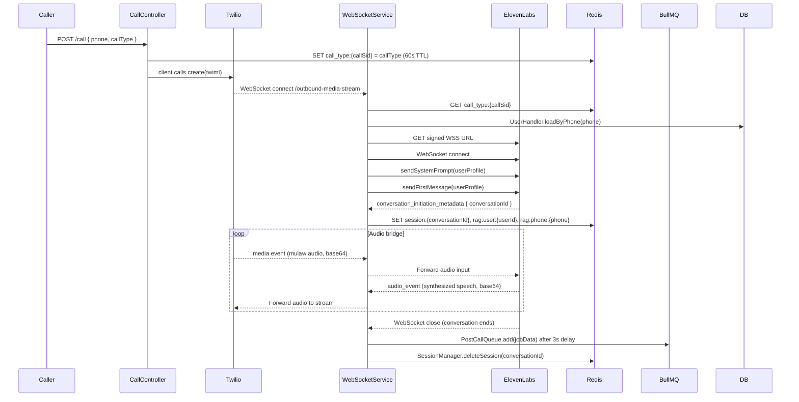

# @naiber/server — Telephony Layer

`@naiber/server` (port 3000) is the telephony boundary of the system. It owns the Twilio WebSocket connection, the ElevenLabs WebSocket session, and call lifecycle management. It never calls `llm-server` directly — ElevenLabs dials `llm-server:3001/v1/chat/completions` itself for each conversation turn.

For the full end-to-end picture see `docs/arch/overview.md`. This document goes deep on server internals only.

---

## Responsibilities

- Receive call initiation requests (`POST /call`, `POST /call/health-check`)
- Dial the user via Twilio and handle TwiML
- Establish and manage the ElevenLabs ConvAI WebSocket session
- Bridge bidirectional audio: Twilio ↔ ElevenLabs
- Inject system prompts and first messages into the ElevenLabs session
- Track active call sessions in Redis
- Dispatch post-call BullMQ jobs

**Does NOT own:** LLM logic, LangGraph graphs, data persistence beyond session tracking, or queue consumption.

---

## Directory Layout

```
packages/server/src/
├── controllers/
│   └── CallController.ts       # WebSocket server init, call creation, TwiML endpoint
├── handlers/
│   └── UserHandler.ts          # UserProfile class — loads user data for prompt generation
├── prompts/
│   ├── PromptInterface.ts      # Abstract base: tone, cultural sensitivity, emergency detection
│   ├── GeneralPrompt.ts        # Companionship persona prompt
│   ├── HealthPrompt.ts         # Structured health check-in prompt
│   └── CognitivePrompt.ts      # Placeholder — no logic yet
├── queues/
│   └── PostCallQueue.ts        # BullMQ producer (post-call-processing)
├── routes/
│   ├── CallRoutes.ts           # POST /call, POST /call/health-check, GET /sessions
│   └── StatusRoute.ts
├── services/
│   ├── WebSocketService.ts     # ElevenLabs session, audio streaming, call lifecycle
│   └── SessionManager.ts       # Redis-backed session CRUD
├── clients/
│   └── RedisClient.ts          # Local Redis client instance (separate from shared-clients)
├── utils/
│   └── ngrok.ts                # Dynamic ngrok URL setup for local dev
└── index.ts
```

---

## Call Lifecycle



### Phase breakdown

**1. Call initiation** (`CallController.createCall()`)
- Accepts `callType` (`'general'` | `'health_check'`) from the route
- Stores `call_type:{callSid}` in Redis with 60s TTL — this bridges the gap before the WebSocket connects and before `conversationId` is known
- Twilio dials the user, its audio stream arrives at `/outbound-media-stream`

**2. WebSocket established** (`WebSocketService`)
- On Twilio `connected` event: captures the WebSocket reference
- On Twilio `start` event: `manageStartEvent()` runs — reads `call_type:{callSid}` from Redis, loads `UserProfile`, opens ElevenLabs WebSocket
- On Twilio `stop` event or ElevenLabs close: `closeWSConnection()` triggers cleanup

**3. ElevenLabs session** (`connectToElevenLabs()`)
- Fetches a signed WSS URL from the ElevenLabs ConvAI API
- Connects and immediately sends a `conversation_config_override` message containing:
  - The full system prompt (generated from the user's profile)
  - The first spoken message
  - Voice ID

**4. Session registration** (on `conversation_initiation_metadata` event)
- ElevenLabs sends `conversationId` at session start
- `SessionManager.createSession()` writes three Redis keys (see Redis section below)

**5. Audio bridge**
- Twilio sends base64-encoded mulaw audio → forwarded to ElevenLabs
- ElevenLabs sends base64-encoded audio events → forwarded to Twilio stream
- A WebSocket keepalive ping runs every 30s to ElevenLabs

**6. Call end**
- ElevenLabs closes the WebSocket (either naturally or triggered by `llm-server` via Twilio)
- `closeWSConnection()`: clears keepalive interval, closes both sockets
- After a 3s delay (to allow transcript readiness), dispatches BullMQ `post-call-processing` job
- `SessionManager.deleteSession()` removes session + RAG mapping keys from Redis

---

## Prompts

All system prompts live in `server/src/prompts/` and are passed directly to ElevenLabs over WebSocket at session start. **Do not move them to `llm-server`** — they are tightly coupled to the server's session context (user profile, first-call detection, call type).

### Hierarchy

```
PromptInterface (abstract)
├── GeneralPrompt
├── HealthPrompt
└── CognitivePrompt (placeholder)
```

**`PromptInterface.ts`** — Shared base with:
- Tone and communication style rules (warm, patient, no medical advice)
- Cultural sensitivity guidelines
- Emergency detection instructions (if user mentions crisis, provide emergency number)
- Abstract `generateSystemPrompt(userProfile)` method
- Abstract `generateFirstMessage(userProfile)` method

**`GeneralPrompt.ts`**
- Companionship and active listening persona
- Encourages sharing memories, interests, daily events
- Passive health awareness (can note symptoms but not diagnose)
- Dynamic first message: varies by time of day, whether it's a first call or returning user, user's known interests

**`HealthPrompt.ts`**
- Structured health data collection persona
- Explicitly scoped to asking questions and recording answers — no advice or interpretation
- Question delivery rules (one at a time, natural language, validate answers)
- Fixed first message introducing the health check-in

**`CognitivePrompt.ts`** — Empty placeholder.

### Prompt generation
`WebSocketService` calls `new GeneralPrompt(userProfile).generateSystemPrompt()` (or `HealthPrompt`). The resulting string is sent as a `conversation_config_override.agent.prompt.prompt` field over the ElevenLabs WebSocket.

---

## UserHandler

`handlers/UserHandler.ts` exports a `UserProfile` class. It is used during prompt generation to load and shape user data for injection.

Key methods:
- `static UserProfile.loadByPhone(phone)` — Queries DB via `UserRepository`, returns `UserProfile` or `null`
- `getBasicInfo()` — Returns `{ name, age, gender }`
- `getLastConversationSummary()` — Returns most recent conversation summary for returning-user context in prompts
- Fields: `id`, `phone`, `name`, `age`, `gender`, `interests[]`, `dislikes[]`, `isFirstCall`, `lastCallAt`

---

## PostCallQueue (Producer)

`queues/PostCallQueue.ts` is a BullMQ **producer only**. The consumer lives in `llm-server/src/workers/PostCallWorker.ts`.

Job schema (`PostCallJobData`) is defined in `@naiber/shared-core/types/queue-contracts.ts` — never define it locally.

```typescript
// PostCallJobData shape (from shared-core)
{
  conversationId: string
  userId: string
  isFirstCall: boolean
  callType: 'general' | 'health_check'
  timestamp: number
}
```

**Deduplication:** An in-memory `Set` tracks recently processed `conversationId`s with a 5-minute TTL. Duplicate jobs for the same conversation within that window are dropped silently. This guards against double-dispatch if `closeWSConnection()` is called more than once.

**Job options:** 3 attempts, exponential backoff starting at 1s, `removeOnComplete: 100`, `removeOnFail: 50`.

---

## SessionManager

`services/SessionManager.ts` provides CRUD for active call sessions in Redis.

| Method | What it does |
|---|---|
| `createSession(conversationId, data)` | Writes `session:{conversationId}` (1h TTL) + `rag:user:{userId}` + `rag:phone:{phone}` mappings |
| `getSession(conversationId)` | Returns parsed session data or `null` |
| `deleteSession(conversationId)` | Removes all three keys |

Sessions are consumed by `llm-server`'s `ConversationResolver` to look up call context from an incoming ElevenLabs request.

---

## Redis Keys Owned by server

| Key | TTL | Value |
|---|---|---|
| `call_type:{callSid}` | 60s | `'general'` \| `'health_check'` |
| `session:{conversationId}` | 1h | `{ callSid, userId, phone, streamSid, startedAt, callType }` |
| `rag:user:{userId}` | 1h | `conversationId` |
| `rag:phone:{phone}` | 1h | `conversationId` |

> Note: `server` has its own local `RedisClient` (`clients/RedisClient.ts`), separate from the `RedisClient` in `@naiber/shared-clients`. Both connect to the same Redis instance but are separate singleton instances.

---

## Environment Variables

| Variable | Purpose |
|---|---|
| `PORT` | Server port (default `3000`) |
| `TWILIO_ACCOUNT_SID`, `TWILIO_AUTH_TOKEN`, `TWILIO_NUMBER` | Twilio credentials |
| `ELEVENLABS_API_KEY`, `ELEVENLABS_AGENT_ID`, `ELEVENLABS_BASE_URL`, `ELEVENLABS_NUMBER_ID` | ElevenLabs ConvAI config |
| `ELEVENLABS_VOICE_ID` | Voice ID for TTS |
| `OPENAI_API_KEY`, `OPENAI_BASE_URL` | Used for prompt generation utilities |
| `PHONE_NUMBER` | Target phone number to call |
| `REDIS_URL` | Redis connection (default `redis://localhost:6379`) |
| `BASE_URL`, `TWILIO_URL`, `STREAM_URL` | Callback URLs — set by ngrok or environment |
| `USE_DYNAMIC_NGROK`, `NGROK_API_URL` | Dynamic ngrok tunnel for local dev |

---

## Gotchas

- **System prompt changes affect live calls immediately** — prompts are injected fresh each session; there's no caching between calls.
- **`CallController2.ts` has a pre-existing TS build error** — unrelated to active development. Do not touch without investigating root cause.
- **The 3s post-call delay is intentional** — ElevenLabs transcripts may not be immediately available when the WebSocket closes. The delay gives ElevenLabs time to finalize the transcript before `llm-server`'s PostCallWorker reads it.
- **60s TTL on `call_type:{callSid}`** — If Twilio takes longer than 60s to connect its WebSocket after the call is created, `call_type` will be missing and the call defaults to `'general'`. In practice this doesn't happen under normal conditions.
- **ElevenLabs keepalive every 30s** — If the keepalive ping fails, the session may silently drop. Check WebSocket close codes when debugging dropped calls.
