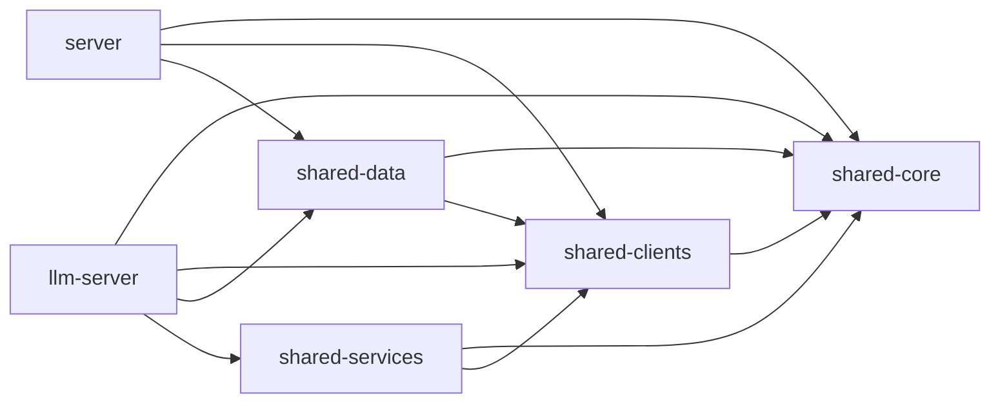

# Shared Packages

The four `@naiber/shared-*` packages form the foundation layer of the monorepo. They are consumed by `@naiber/server` and `@naiber/llm-server` but have no knowledge of either. Each layer has a single responsibility and dependencies flow in only one direction.

---

## Dependency Direction



**No circular dependencies are allowed.** `shared-core` has zero runtime code and can be safely imported by any package. `shared-clients` never imports from `shared-data` or `shared-services`.

### Build order

```
shared-core → shared-clients → shared-data → shared-services → server / llm-server
```

All packages use `tsc --build` with TypeScript project references. Run `npm run build` from the repo root. If you add a new package or dependency, update `tsconfig.json` references in both the consuming package and the root `tsconfig.json`.

---

## @naiber/shared-core

**Role:** Zero-dependency types package. The foundation — every other package depends on this.

**What it owns:**

`types/database.ts`
- Prisma-derived types: `UserProfileData`, `EmergencyContact`, `HealthCondition`, `Medication`, `ConversationTopic`, `ConversationSummary`, `BasicInfo`
- `userProfileInclude` — Prisma include validator for full user profile queries with all relations

`types/queue-contracts.ts`
- `PostCallJobData` interface — the shape of every BullMQ `post-call-processing` job
- `POST_CALL_QUEUE_NAME` constant
- **Single source of truth for BullMQ message shapes.** Never define queue schemas locally in producer or consumer packages.

**What it does NOT own:**
- No runtime code, no service logic, no external connections
- Does not define LangGraph state types (those live in persona folders in `llm-server`)

**Gotchas:**
- `database.ts` imports from `../../../../generated/prisma/index.js` — this relative path is sensitive to file depth. If you move the file, update the import path.
- Any new job type or queue must be added to `queue-contracts.ts`, not defined locally.

---

## @naiber/shared-clients

**Role:** External service connections. Each client is a standalone wrapper around a third-party SDK with no business logic.

**What it owns:**

| Client | SDK | Notes |
|---|---|---|
| `OpenAIClient.ts` | `openai`, `@langchain/openai` | Chat completions, embeddings, streaming. Exports `Message`, `ChatCompletionRequest` types. |
| `ElevenlabsClient.ts` | Custom HTTP/WS | Voice conversation API. Exports `CallMessage`, `ElevenLabsConfigs`, `TranscriptMessage` types. |
| `TwilioClient.ts` | `twilio` | Phone calls and SMS. |
| `PrismaDBClient.ts` | `@prisma/client` | Prisma singleton connection. |
| `RedisClient.ts` | `redis` | Redis singleton with JSON helpers, pattern delete, hash operations. |
| `QdrantClient.ts` | `axios` | Low-level Qdrant REST client. **Technically redundant — kept but not actively used.** |
| `VectorStoreClient.ts` | `@langchain/qdrant` | LangChain `QdrantVectorStore` wrapper. **This is the active vector store client.** |

**What it does NOT own:**
- No business logic, no data access patterns, no orchestration
- No prompt templates (those live in `server/src/prompts/`)
- Interface types for clients (`ChatCompletionRequest`, `ElevenLabsConfigs`, etc.) are exported from the client files themselves, **not** from `shared-core`

**Environment:**
- `REDIS_URL` — Read directly from env by `RedisClient`
- `ELEVENLABS_API_KEY` — Read directly from env by `ElevenlabsClient`
- All other credentials (`OPENAI_API_KEY`, `TWILIO_*`, `QDRANT_*`) are injected via constructor config by the consuming package — **not** read from env directly inside client files

**Singletons:**
- `PrismaDBClient` and `RedisClient` are singletons — importing them multiple times returns the same instance. Do not instantiate them with `new` outside their own files.

**Gotchas:**
- `PrismaDBClient.ts` imports from `../../../generated/prisma/index.js` — path is relative to the repo root. Prisma generates types to `generated/prisma/` at the root.
- `QdrantClient.ts` exists but `VectorStoreClient.ts` is what everything actually uses. Don't add new code against `QdrantClient`.
- Type exports live in client files, not in `shared-core`. When adding a new type related to an external service, export it from that client file.

---

## @naiber/shared-data

**Role:** Data access layer. Repositories (Prisma) and stores (Redis caching). Pure data access — no business logic.

**What it owns:**

`repositories/UserRepository.ts`
- `getUserByPhone(phone)` — Full profile query using `userProfileInclude` from `shared-core`
- Returns `UserProfileData` (with conditions, medications, topics, summaries joined)

`repositories/ConversationRepository.ts`
- Conversation CRUD, summary creation, topic upserts, message storage
- Locally defines `Summary` and `TranscriptMessage` interfaces (conversation-specific, not in shared-core)

`repositories/HealthRepository.ts`
- Health conditions, medications, and log entries (health check answers → DB rows)
- Locally defines `HealthCheckLogData`, `MedicationLogData`, `HealthConditionLogData` interfaces

`stores/RedisEmbeddingStore.ts`
- LangChain `BaseStore` implementation backed by Redis
- Used for caching embeddings between calls (cache-backed embeddings pattern)
- Consumed by `EmbeddingService` in `shared-services`

**What it does NOT own:**
- No business logic or orchestration — repositories are pure data access
- Does not define the database schema — that's in `prisma/schema.prisma` at the repo root
- Does not define `UserProfileData` — that comes from `shared-core`

**Gotchas:**
- Repositories use the Prisma client singleton from `shared-clients`. Do not create new Prisma client instances.
- `HealthRepository` write methods are called by `HealthPostCallGraph` in `llm-server` during post-call processing. The interface types (`HealthCheckLogData`, etc.) live locally in `HealthRepository.ts` — if `llm-server` needs them, it imports directly from the repository file.

---

## @naiber/shared-services

**Role:** Business logic utilities shared across server packages. Composes `shared-clients` and `shared-data` into reusable services.

**What it owns:**

`EmbeddingService.ts`
- `CacheBackedEmbeddings` using OpenAI + LangChain
- Caches embeddings in Redis via `RedisEmbeddingStore` from `shared-data`
- Handles text preprocessing before embedding via `TextPreprocessor`
- Used by `llm-server` in `TopicManager`, `PostCallWorker`, and `LLMRoute`

`TextPreprocessor.ts`
- **Single source of truth for text cleanup** — do not duplicate this logic elsewhere
- Uses `compromise` NLP for: filler word removal, key term extraction, semantic essence extraction
- Produces cleaner text strings for embedding (reduces noise in vector representations)

**What it does NOT own:**
- No external service connections (those are in `shared-clients`)
- No data access (that's `shared-data`)
- `UserHandler` was moved to `server/src/handlers/` — it is server-only and does not belong here

**Gotchas:**
- `TextPreprocessor` uses `compromise` — if you see inconsistent embedding quality, check whether text is being preprocessed before embedding.
- `EmbeddingService` is not a singleton by design — it accepts a `RedisEmbeddingStore` instance at construction time. Callers are responsible for managing the instance lifetime.
- Only `llm-server` currently depends on `shared-services`. If `server` ever needs embeddings, import `EmbeddingService` from here — do not copy the logic.

---

## Import Conventions

All packages use ESM (`"type": "module"` in `package.json`). All internal imports must use `.js` extensions — TypeScript resolves these to `.ts` at build time but the emitted JS requires them explicitly:

```typescript
// Correct
import { UserProfileData } from '@naiber/shared-core/types/database.js'
import { prismaClient } from '@naiber/shared-clients/PrismaDBClient.js'

// Wrong — will fail at runtime in ESM
import { UserProfileData } from '@naiber/shared-core/types/database'
```

When adding a new export from a shared package, ensure the file path is included in that package's `tsconfig.json` `include` array and that the consuming package has a project reference to it.
