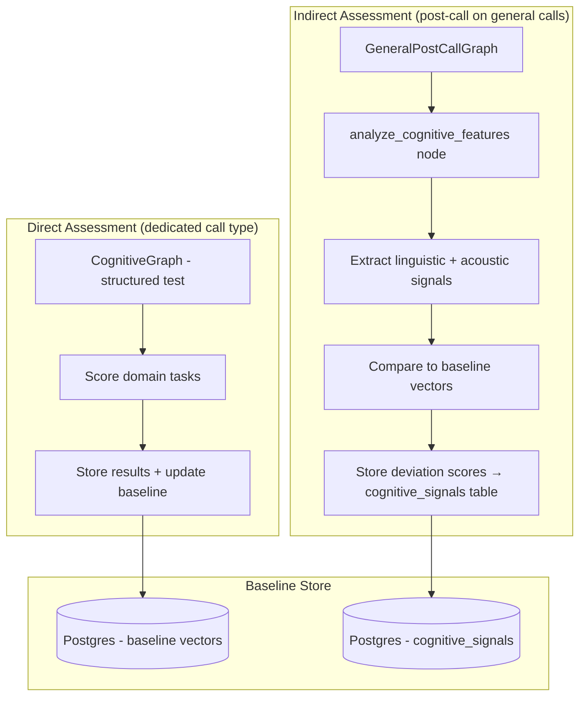

# Cognitive Assessment Persona — Product Requirements

> **Implementation status:** Placeholder. `CognitiveGraph.ts`, `CognitiveHandler.ts`, `CognitiveState.ts`, and `CognitivePrompt.ts` exist in the codebase but contain no logic. This PRD defines the full design so implementation can begin from a clear spec.

---

## Purpose

The cognitive assessment system tracks communication and cognitive patterns over time to surface meaningful changes for users and their caregivers. It is not a diagnostic tool — it does not label, diagnose, or prescribe. Its purpose is to make subtle trends visible and interpretable.

The system operates on two tiers:

| Tier | How | When |
|---|---|---|
| **Direct assessment** | Structured cognitive test via a dedicated call type | On demand or scheduled |
| **Indirect assessment** | Passive linguistic + acoustic analysis | Post-call on every general conversation call |

Direct assessment establishes a quantitative baseline per user. Indirect assessment continuously compares daily communication patterns against that baseline to detect drift. Together they provide a longitudinal picture of cognitive stability.

---

## Domain Boundary with Health Check

**Clean split:** health check covers physical health (symptoms, medications, physical functioning). Cognitive covers mental function (memory, attention, language, reasoning). No shared questions.

However, for knowledge base and Knowledge Graph purposes, health and cognitive data are used together. Health conditions and medications may correlate with cognitive signal changes — cross-referencing both data sources enriches interpretation even though the collection pipelines are separate.

---

## What a Successful Assessment Looks Like

### Direct test
- The user completes the full test (all domain tasks) within the session.
- Domain scores are computed and stored.
- Baseline is created (first test) or updated (subsequent tests).

### Indirect assessment (per general call)
- Linguistic and acoustic features are extracted from the call transcript.
- Deviation scores against baseline are computed and stored.
- No output to the user — this is silent monitoring.

### Overall
- Trends are visible in the dashboard over time.
- Caregivers and users can observe changes without the system drawing clinical conclusions.

---

## User Experience Model

### Functional requirements

- **Direct test:** Presented as a warm, brief "mind exercise" (~2–4 minutes). The user is told what it is — not hidden. Delivered conversationally, not clinically.
- **Indirect monitoring:** Completely transparent to the user. Happens post-call as part of the general call pipeline. The user is aware (via onboarding/consent) that regular calls are analysed passively.
- The AI never references cognitive performance during a call — it does not say "your score was..." or "that seemed harder for you today." Analysis is post-call only.
- Tone is warm, patient, and encouraging throughout the direct test — the user should not feel like they are failing a test.

### Non-functional requirements

- **Non-diagnostic language everywhere** — no "impairment", "decline", or clinical framing in the UI or AI responses.
- **Longitudinal consistency** — direct tests must use the same task set across sessions to ensure comparability. Task variation invalidates trend data.
- **Baseline validity** — a baseline built on insufficient data is misleading. Minimum data requirements for baseline creation must be defined before shipping Phase 1.

---

## Architecture Overview



---

## Tier 1: Baseline Establishment

The baseline is the reference point for all future indirect analysis. It must be established before indirect monitoring produces meaningful results.

### What the baseline captures

| Data | Source | Purpose |
|---|---|---|
| Contextual data | Onboarding form | Normalise speech/language norms (age range, education level, primary language) |
| Audio/text samples | Onboarding | Capture the user's typical communication style |
| Direct cognitive test results | First direct call | Quantitative anchor across cognitive domains |
| Trusted contact observations | Onboarding form | Qualitative context on normal communication and alertness |

### Baseline metrics extracted

From the initial direct test and audio samples:
- **Speech rate** — words per minute
- **Response latency** — time between question and response onset
- **Pause distribution** — average and variance of pause duration
- **Pitch variance** — monotone vs. dynamic delivery
- **Lexical diversity** — unique words as proportion of total words
- **Semantic coherence** — embedding similarity across sentences
- **Filler word frequency** — rate of "um", "uh", restarts

Metrics are normalized per user (z-scores). Both raw and normalized values are stored. These become the baseline vectors used for deviation scoring in indirect analysis.

### Baseline storage
Stored in Postgres linked to `userId`. Full vector history is kept (not overwritten) to support visualization of baseline evolution over time.

### Trusted contact
A person chosen by the user during onboarding. They submit a brief qualitative description of the user's normal communication and alertness patterns via a frontend form. This input grounds quantitative signals in human context. *(Onboarding flow for trusted contact not yet designed — flagged as open below.)*

---

## Tier 2: Direct Cognitive Test

### Call type
A dedicated call type — scheduled or on-demand, separate from general and health check calls. Triggered similarly to health check (`POST /call/cognitive`).

### Graph structure
Implemented as a `CognitiveGraph` in `llm-server/src/personas/cognitive/`. Follows the same interrupt/resume pattern as `HealthCheckGraph` — each task is a question-answer cycle with durable checkpoint state.

**Node structure (per task):**
```
prompt_task → wait_for_response (interrupt) → evaluate_response → measure_metrics → next_task_or_finalize
```

State persists: current task index, responses collected, timing metrics, domain scores.

### Cognitive domains and task types

| Domain | Task type | Example |
|---|---|---|
| Attention / processing speed | Reverse digit span | "I'll say some numbers — can you say them back to me in reverse order?" |
| Working memory | Delayed word recall | Three words introduced early in the call, recalled later |
| Semantic fluency | Category naming | "Name as many fruits as you can in 30 seconds" |
| Language comprehension | Proverb interpretation | "What do you think 'every cloud has a silver lining' means?" |
| Reasoning / abstraction | Similarity/difference | "How are a river and a lake alike?" |

### Metrics per task
- **Content accuracy** — correctness of answer against expected response (via cosine similarity for open-ended tasks, exact match for digit span)
- **Response latency** — timestamp from question delivery to response onset
- **Speech rate** — words per minute during response
- **Lexical richness** — unique words in the response

### Scoring
Each domain produces a normalized score. Scores are stored with timestamps, allowing trend analysis across sessions. *(Exact scoring thresholds and domain weighting not yet defined — flagged as open below.)*

### Test duration
Target: 2–4 minutes. Tasks should be short, warm, and conversational — not clinical.

---

## Tier 3: Indirect Assessment (Passive)

### When it runs
Post-call, on every general conversation call. Added as a node (`analyze_cognitive_features`) in `GeneralPostCallGraph`, after summarization and RAG embedding.

### Signals extracted

| Signal | Extraction method |
|---|---|
| Speech rate | Word count / call duration from transcript |
| Pause distribution | Timestamped transcript turn gaps |
| Pitch variance | Audio analysis (e.g. pyAudioAnalysis, praat-parselmouth, torchaudio) |
| Lexical diversity | Unique-to-total word ratio from transcript |
| Semantic coherence | Embedding similarity across consecutive sentences |
| Filler word frequency | Pattern match on transcript ("um", "uh", repeated restarts) |
| Response latency | Timestamped turn data |

### Baseline comparison
Each extracted feature is compared to the user's baseline vector. Output is a normalized deviation score per signal. All scores and raw values are stored in the `cognitive_signals` table in Postgres.

### Audio processing dependency
Acoustic features (pitch, pause distribution) require access to raw audio or processed audio metadata from the call. This depends on Twilio/ElevenLabs providing audio or timestamp data post-call. *(Integration not yet designed — flagged as open below.)*

### Feature extraction architecture
The notes recommend a small dedicated feature extraction microservice (FastAPI) that both direct test scoring and indirect analysis call consistently. This keeps `llm-server` lighter and ensures extraction logic is shared. *(Not yet built — flagged as Phase 2.)*

---

## Data Schema

### `cognitive_baselines` (Postgres)
| Field | Type | Notes |
|---|---|---|
| `userId` | string | FK to user |
| `featureVector` | JSON | Normalized baseline values per signal |
| `rawValues` | JSON | Un-normalized metric values |
| `version` | int | Increments on each update |
| `createdAt` | timestamp | |

### `cognitive_test_results` (Postgres)
| Field | Type | Notes |
|---|---|---|
| `userId` | string | |
| `conversationId` | string | |
| `domainScores` | JSON | Normalized score per domain |
| `rawResponses` | JSON | Per-task response, latency, accuracy |
| `completedAt` | timestamp | |

### `cognitive_signals` (Postgres)
| Field | Type | Notes |
|---|---|---|
| `userId` | string | |
| `conversationId` | string | Linked to a general call |
| `signals` | JSON | Raw values per feature |
| `deviationScores` | JSON | Normalized deviation from baseline per feature |
| `stabilityIndex` | float | Composite average deviation |
| `recordedAt` | timestamp | |

---

## Post-Call Flow

### General call (indirect analysis)
```
GeneralPostCallGraph runs:
  1. Create summary → Postgres
  2. Extract topics → Postgres
  3. Generate embeddings → Qdrant
  4. analyze_cognitive_features (Phase 2):
     a. Extract linguistic signals from transcript
     b. Extract acoustic signals (if audio available)
     c. Compare to baseline vectors
     d. Write deviation scores → cognitive_signals table
```

### Cognitive direct test call
```
CognitiveGraph finalize node:
  → Aggregate domain scores
  → Write to cognitive_test_results table
  → Update cognitive_baselines (weighted moving average)

PostCallWorker (callType = 'cognitive'):
  → Read checkpoint state → extract domain scores and responses
  → Invoke CognitivePostCallGraph → persist results
  → Delete checkpoint thread
```

---

## Baseline Updates Over Time

After each new direct test:
1. Pull existing baseline feature vectors from Postgres.
2. Compute weighted moving average between old baseline and latest test results.
3. Store new version alongside previous (no overwrite — full history retained).
4. If deviation persists beyond a configurable drift window: flag baseline for revalidation, optionally notify trusted contact.

Weighted moving average ensures stable patterns have more influence than short-term fluctuations (e.g. a bad day does not reset the baseline).

---

## Data Consumers

| Consumer | Access | Phase |
|---|---|---|
| Users | Dashboard — trend graphs, stability index, plain-language summaries | Phase 3 |
| Caregivers | Dashboard — same data, trusted contact observations included | Phase 3 |
| Trusted contact | Contextual input at onboarding; notified on baseline revalidation events | Phase 1 |
| Knowledge Graph | Health + cognitive data combined for richer semantic memory | Future |

### Dashboard display guidelines
- Trend graphs per core signal (speech rate, coherence, pause duration)
- Composite stability index (average normalized deviation across all signals)
- Color-coded status: green (stable), amber (moderate deviation), red (significant deviation)
- Plain-language summaries generated by LLM: *"Your communication this week showed consistent coherence and slightly slower pacing than your average."*
- No diagnostic language: never "impairment", "decline", "deficit"

---

## ElevenLabs Voice Expectations

- **Tone:** Warm and encouraging — the user is doing something that takes effort.
- **Pacing:** Unhurried. Extra pause time given between instructions and expected response.
- **Task framing:** Introduced as a "brief mind exercise" not a "cognitive test". Casual and friendly.
- **Acknowledgements:** After each task, brief affirmation before moving on — not evaluative ("Great, let's try the next one").
- **Prompt design:** `CognitivePrompt.ts` in `server/src/prompts/` — not yet implemented.

---

## Implementation Phases

### Phase 1 — MVP: Baseline + Direct Test (design target for this PRD)
- Onboarding flow: collect contextual data, trusted contact input, initial audio/text samples
- Direct cognitive test as a dedicated call type via `CognitiveGraph`
- Domain scoring (accuracy + latency + speech metrics per task)
- Baseline storage in Postgres (`cognitive_baselines`, `cognitive_test_results`)
- Schema and PostCallWorker path for `callType = 'cognitive'`

### Phase 2 — MVP: Indirect Metrics
- Add `analyze_cognitive_features` node to `GeneralPostCallGraph`
- Linguistic feature extraction from transcript (speech rate, lexical diversity, coherence, fillers)
- Baseline comparison → deviation scores → `cognitive_signals` table
- Feature extraction microservice (FastAPI) for shared extraction logic
- Acoustic features dependent on audio access from Twilio/ElevenLabs

### Phase 3 — Dashboard Visualization (future)
- REST endpoints: `/api/cognitive/metrics`, `/api/cognitive/trends`
- Interactive graphs (Recharts / Chart.js)
- Stability index visualization
- LLM-generated plain-language summaries
- Trusted contact data surfaced alongside metrics

### Phase 4 — Adaptive Learning (future)
- Baseline drift detection via z-score thresholding or lightweight anomaly model
- Exponential smoothing for baseline updates
- Rolling baseline history for evolution visualization
- Predictive stability scoring (correlate indirect signals with direct test results)

---

## Edge Cases

| Scenario | Expected behaviour |
|---|---|
| User has no baseline yet | Indirect analysis stores raw signals but skips deviation scoring. Baseline must exist before deviation scores are meaningful. |
| User shows significantly different performance on direct test | Weighted moving average absorbs single-session variance. Persistent deviation over configurable window triggers baseline revalidation. |
| User becomes distressed during direct test | Stop the test. Transition to empathetic close. Record partial results. Flag for human review. |
| User refuses tasks during direct test | Record as skipped. Move to next task. Finalize with partial scores. |
| Call drops mid-direct-test | Checkpoint state is preserved. Partial results are recoverable from checkpoint. Post-call worker handles partial result persistence. |
| Audio not available for acoustic features | Linguistic features still extracted from transcript. Acoustic signals skipped. Noted in stored signal record. |

---

## Open Decisions (Required Before Phase 1 Implementation)

These decisions are not yet made and must be resolved before building begins:

| Decision | Why it matters |
|---|---|
| **Minimum data requirements for a valid baseline** | A baseline built on one 2-minute sample may not be representative. What's the minimum before indirect analysis is enabled? |
| **Scoring model and domain weighting** | How are domain scores combined? Are all domains equally weighted? Is there a threshold below which a test is flagged? |
| **Drift thresholds** | What deviation magnitude over what time window triggers a baseline revalidation? |
| **Trusted contact onboarding flow** | How does the trusted contact submit input? Frontend form, SMS, email? What's the UX? |
| **Audio access from Twilio/ElevenLabs** | Are raw audio or timestamped transcripts available post-call for acoustic feature extraction? This blocks Phase 2 acoustic signals. |
| **Feature extraction service vs. in-process** | FastAPI microservice (recommended in notes) vs. in-process in `llm-server`. Decision affects Phase 2 architecture. |
| **Consent and disclosure model** | Users must be informed that general calls are passively analysed. Where and how is this disclosed? |
| **Relationship between cognitive signals and Knowledge Graph** | Health + cognitive data are both inputs to the KG. The integration model hasn't been designed. See `docs/future/knowledge-graph.md`. |
