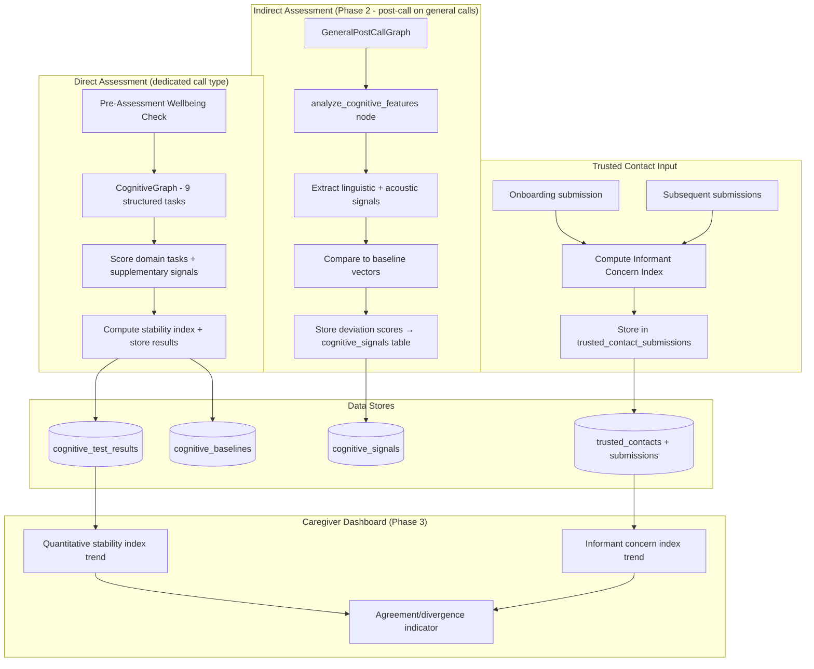

# Cognitive Assessment Persona — Product Requirements

> **Implementation status:** Phase 1 design complete. `CognitiveGraph.ts`, `CognitiveHandler.ts`, `CognitiveState.ts`, and `CognitivePrompt.ts` exist in the codebase but contain no logic. This PRD defines the full design so implementation can begin from a clear spec.

---

## Purpose

The cognitive assessment system tracks communication and cognitive patterns over time to surface meaningful changes for users and their caregivers. It is not a diagnostic tool — it does not label, diagnose, or prescribe. Its purpose is to make subtle trends visible and interpretable.

**This is the nAIber Cognitive Wellness Check** — a proprietary longitudinal monitoring tool. It is explicitly **not** a licensed clinical instrument. It does not produce a clinical score, and it must never be presented as equivalent to MoCA, MMSE, or any other validated clinical battery.

The system operates on two tiers:

| Tier | How | When |
|---|---|---|
| **Direct assessment** | Structured cognitive test via a dedicated call type | Monthly, system-initiated (user can decline/reschedule) |
| **Indirect assessment** | Passive linguistic + acoustic analysis | Post-call on every general conversation call (Phase 2) |

Direct assessment establishes a quantitative baseline per user. Indirect assessment continuously compares daily communication patterns against that baseline to detect drift. Together they provide a longitudinal picture of cognitive stability.

---

## Licensing and Legal Positioning

### What nAIber is NOT
- **Not MoCA.** The Montreal Cognitive Assessment is a proprietary, copyrighted instrument. Administering it requires a trained, licensed health professional and a paid license from mocastest.org. nAIber does not use, reproduce, or claim equivalence to MoCA.
- **Not MMSE.** The Mini-Mental State Examination is similarly proprietary (Psychological Assessment Resources).
- **Not a diagnostic tool.** nAIber does not diagnose mild cognitive impairment, dementia, or any clinical condition. It does not produce a pass/fail score or clinical classification.

### What nAIber IS
- **A trend-detection and early-signal tool.** The clinical value is: "Over the last 3 months, your recall latency has increased and your fluency scores have shifted — here's the trend, share it with your doctor."
- **Built on public-domain cognitive tasks.** Digit span, word recall, category fluency, similarity judgement, and serial arithmetic are decades-old neuropsychological techniques that appear in dozens of validated instruments. No single instrument owns these task types. nAIber assembles them into a proprietary battery designed for conversational voice delivery and longitudinal monitoring.
- **A supplement to professional evaluation, not a replacement.** The dashboard and all user-facing language must communicate this clearly.

### Legal review items (pre-launch)
Before Phase 1 ships, the following must be reviewed by legal counsel:
- Disclaimer language on the dashboard and in onboarding consent
- Ensure no copy implies clinical equivalence or diagnostic validity
- Review the term "Cognitive Wellness Check" for any trademark or regulatory concerns
- Validate that consent and disclosure language meets applicable regulations for passive indirect monitoring

---

## Domain Boundary with Health Check

**Clean split:** health check covers physical health (symptoms, medications, physical functioning). Cognitive covers mental function (memory, attention, language, reasoning). No shared questions.

However, for knowledge base and Knowledge Graph purposes, health and cognitive data are used together. Health conditions and medications may correlate with cognitive signal changes — cross-referencing both data sources enriches interpretation even though the collection pipelines are separate.

---

## Block 1 — Stakeholder Output Model

### The Asymmetry Principle

The elderly user and the caregiver have fundamentally different relationships to the data:

- **The elderly user** is the subject of the assessment. Their relationship is personal and emotional. Seeing cognitive decline data can cause anxiety, shame, or denial. Their primary need is **reassurance and continuity**.
- **The caregiver** is an observer and decision-maker. Their relationship is functional. They need to know whether to act. Their primary need is **actionable signal**.

This difference drives every display decision.

### What the elderly user sees

Less is more. A user who sees scores dropping may become anxious, which directly worsens cognitive performance in subsequent tests — or they disengage entirely.

**Show:**
- Participation confirmation — "You completed your wellness check on March 1st."
- Streak / consistency indicator — how regularly they've been engaging, framed positively
- A single, simple stability indicator — plain language, non-numerical, LLM-generated from underlying data (e.g. "Your communication has been consistent this month.")
- Next scheduled check-in date

**Do NOT show:**
- Raw scores or domain breakdowns
- Trend graphs showing direction of change
- Deviation scores or anything implying comparison to a prior self
- Any language that could be interpreted as "you are declining"

The user's dashboard is closer to a **wellness journal** than a clinical report.

### What the caregiver / trusted contact sees

Enough detail to make decisions, framed to avoid drawing clinical conclusions the system isn't qualified to support.

**Show:**
- Trend graphs per domain over time — labeled as communication patterns, not diagnoses
- Composite stability index with history
- Test participation history — dates completed, partial or skipped tests
- Notable session flags — distress detected, test aborted, significant single-session deviation
- Their own IQCODE-style input history — what they submitted at onboarding and subsequent updates
- Plain-language summary — LLM-generated (e.g. "Over the past 6 weeks, recall performance has been consistent while verbal fluency has shown some variability")
- Suggested action prompt when drift is detected — not "something is wrong" but "it may be worth discussing recent changes with a healthcare provider"

**Do NOT show:**
- Clinical labels or diagnostic language
- A definitive "score" that implies clinical validity
- Anything positioning nAIber as a diagnostic tool

### Future clinical viewer (Phase 3+)

Not built in Phase 1 but the data model supports it. A clinician would need:
- Raw task-level data, not just aggregated scores
- Session metadata — time of day, call duration, anomalies
- Full signal set including acoustic features
- Longitudinal export (PDF report or structured data export)
- Explicit statement of instrument used and its validation status

This is why keeping raw responses in the schema matters.

### Transparency model

Determined at onboarding: users and caregivers define what the caregiver can see. This is a hybrid of full transparency + tiered visibility with selective sharing for some elements.

### Cadence model

| Parameter | Value | Rationale |
|---|---|---|
| Direct test frequency | Monthly, system-initiated | User can decline and reschedule |
| Minimum for trend display | 3 completed tests | Before that, caregiver sees "building baseline" |
| Caregiver notification trigger | Sustained drift over rolling window | 2 of 3 consecutive tests showing same direction of change |
| Single-session deviation | No notification | Prevents alarm from a single bad day |

---

## Block 2 — Assessment Architecture

### Cognitive Domains

Six domains total — comprehensive enough to be meaningful, narrow enough to complete in 4–6 minutes.

| Domain | Why Included | Why Voice-Assessable |
|---|---|---|
| Orientation | Earliest and most reliable indicator of cognitive change. Disorientation to time is a consistent early signal across dementia subtypes. | Simple verbal Q&A |
| Attention & Concentration | Required for all other cognitive functions. Deficits show up early and affect daily functioning significantly. | Digit span and serial 7s are purely auditory tasks |
| Working Memory | Distinct from long-term memory — ability to hold and manipulate information in the moment. Degrades early in MCI. | Reverse digit span directly tests this |
| Delayed Recall | Single strongest predictor of Alzheimer's-type progression. Encoding vs. retrieval distinction is clinically meaningful. | Word list registration and recall is entirely verbal |
| Language & Verbal Fluency | Decline in word-finding and fluency is an early and consistent signal. Also captured passively in general calls. | Letter fluency task, natural speech analysis |
| Abstraction & Reasoning | Tests higher-order thinking — identifying conceptual relationships. More resistant to practice effects than memory tasks. | Similarity/difference questions are purely verbal |

### Domains explicitly excluded

**Visuospatial & Executive Function:** Clock drawing, trail-making, cube copying require visual-spatial production and interpretation. Cannot be administered or evaluated via voice. Covers planning ability, spatial reasoning, and visual construction.

**Visual Naming:** Identifying objects/animals from pictures requires visual stimulus. Not applicable to voice.

**UI language (mandatory in onboarding, dashboard, and results):** "The nAIber wellness check covers six areas of cognitive health that can be assessed through conversation. It does not assess visual-spatial abilities or visual recognition. For a complete cognitive evaluation, we recommend speaking with your doctor."

### Canonical Task Sequence

Tasks are sequenced so cognitively demanding tasks come before fatiguing ones, and delayed recall is bookended around everything else. **The sequence is fixed across all sessions** — changing it would invalidate longitudinal comparisons.

| Position | Task | Domain | Why Here |
|---|---|---|---|
| 1 | Orientation | Orientation | Low-stakes warm-up, establishes rapport |
| 2 | Word Registration | Delayed Recall (encoding) | Must happen early — the delay before recall is the test. Target 8–12 min gap. |
| 3 | Digit Span Forward | Attention | Before fatigue, purely auditory |
| 4 | Digit Span Reverse | Working Memory | Same stimulus type as forward, higher demand |
| 5 | Serial 7s | Attention & Concentration | Demanding arithmetic before cognitive fatigue |
| 6 | Letter Vigilance | Sustained Attention | Different attention modality than span |
| 7 | Letter Fluency | Language & Verbal Fluency | Active generative task, breaks up attention sequence |
| 8 | Abstraction | Reasoning | Higher-order, fatigue-resistant |
| 9 | Delayed Recall | Delayed Recall (retrieval) | Always last — maximizes delay from registration |

### Pre-Assessment Wellbeing Check

Runs at the start of every direct test call, before any cognitive tasks. Purpose: reduce test anxiety through brief rapport-building, and screen for conditions that would make results unrepresentative.

**Three questions (conversational, open-ended):**
1. "Before we get started, I just want to check in — how are you feeling today overall?"
2. "Have you had a chance to sleep okay recently?"
3. "Is there anything on your mind today, or anything that's been worrying you?"

Responses are analyzed post-call for distress signals. The user's self-reported state is stored as context alongside test results.

**Graceful exit triggers:**

| Signal | Response |
|---|---|
| User explicitly states they feel unwell, in pain, or very tired | "That's completely okay — let's not do this today. We can reschedule for when you're feeling better." End call, log as deferred. |
| User expresses significant emotional distress | Transition to empathetic conversation. Log as deferred with distress flag. |
| User is confused about what the call is for | Brief re-explanation. If still confused after one clarification, defer. |
| User declines to proceed | "No problem at all. We can do this another time." Log as user-declined. |

**What does NOT trigger exit:**
- Mild tiredness ("a bit sleepy")
- Mild test anxiety ("I'm not sure I'll remember things well") — respond with reassurance: "There are no right or wrong answers here — this isn't a test you can fail. We're just having a conversation."
- Physical issues not affecting cognition (sore knee, etc.)

**Deferred session handling:**
- Logged with reason code, not included in trend analysis
- Next scheduled test moved forward (not skipped)
- Trusted contact NOT notified of single deferral — only a pattern (e.g. 3 consecutive) triggers notification

---

## Block 2b — Trusted Contact & IQCODE-Style Input

### Architecture

Architecturally separate from the direct test. The trusted contact never interacts with the patient's test results directly — they provide observational context that sits alongside the quantitative data.

### What IQCODE measures (reference)

Asks an informant to compare the patient's current abilities to 10 years ago across 26 items on a validated 5-point scale. Public domain instrument. nAIber uses a lighter version (~10 items) mapping to the same domains assessed directly.

### Onboarding submission (asked once at setup)

| Question | Domain Mapped | Format |
|---|---|---|
| Compared to a few years ago, how often does [name] repeat the same question or story in a short conversation? | Working memory / delayed recall | Never / Sometimes / Often / Very Often |
| Does [name] have difficulty remembering recent events (things that happened in the past week)? | Delayed recall | Never / Sometimes / Often / Very Often |
| Does [name] have trouble keeping track of what day or month it is? | Orientation | Never / Sometimes / Often / Very Often |
| Does [name] seem to lose track of what they were saying mid-sentence? | Attention / language | Never / Sometimes / Often / Very Often |
| Has [name]'s vocabulary or word-finding ability changed? | Language & fluency | No change / Slight change / Noticeable change |
| Does [name] have difficulty following a conversation with multiple people? | Attention | Never / Sometimes / Often / Very Often |
| Has [name]'s ability to make decisions or solve everyday problems changed? | Abstraction / reasoning | No change / Slight change / Noticeable change |
| How would you describe [name]'s typical alertness level during the day? | General — contextual baseline | Open text, short |
| Have you noticed any sudden or gradual changes in [name]'s communication recently? | Open signal | Open text, short |

**Reference point question (added):** "When did you first start noticing any changes, if at all?" — stored as submission context. For younger elderly (60s), 10 years is better. For 80s+, a few years may be all available.

### Subsequent updates

**Triggered by:**
- System-detected drift event (caregiver prompted to resubmit)
- Every 6 months regardless of drift (standing refresh)
- Caregiver-initiated at any time from dashboard

**Follow-up submission:** Shorter — 3–4 items asking whether onboarding observations have changed, plus the two open text fields.

### Trusted Contact Validity

| Relationship Type | Known How Long | Contact Frequency | Validity Tier |
|---|---|---|---|
| Spouse / long-term partner | Decades | Daily | **High** — ideal informant |
| Adult child | Lifetime | Weekly+ | **High** |
| Sibling | Lifetime | Varies | **High** if regular contact |
| Close friend | 10+ years | Regular | **Medium** — acceptable |
| Adult child | Lifetime | Monthly or less | **Medium** — limited observational window |
| Professional caregiver | < 2 years | Daily | **Low** — no historical baseline |
| Neighbor / acquaintance | Any | Occasional | **Not valid** |

**Onboarding collects three questions to determine reliability tier:**
1. How long have you known this person?
2. How often do you typically speak or spend time together?
3. What is your relationship to them?

Low-reliability input is still stored and used — it's current behavioral observation rather than historical comparison. Different weight, not excluded.

**UI implication:** When caregiver dashboard shows informant observations alongside quantitative trends, the reliability tier is surfaced.

### How trusted contact data is used

**Function 1 — Baseline Contextualization:** At onboarding, before the first direct test, the trusted contact submission provides a prior. A user whose contact reports significant recent changes starts with a different contextual flag. The submission produces an **Informant Concern Index** (see Block 4).

**Function 2 — Drift Signal Corroboration:**
| System Signal | Informant Signal | Action |
|---|---|---|
| Drift detected | Concern index elevated | Stronger flag, higher confidence, more urgent notification |
| Drift detected | Concern index low | Softer flag, "worth monitoring", no urgent notification |
| Scores stable | Concern index rising | Surface discrepancy: "Your observations suggest more change than assessments are detecting" |

The third scenario is clinically important — informants sometimes detect early behavioral change before structured tests.

**Function 3 — Session Result Interpretation:** When a single session produces an outlier, the most recent informant submission provides context alongside the pre-assessment wellbeing check for distinguishing genuine cognitive events from bad days.

---

## Block 3 — Question and Task Structure

### Task 1 — Orientation (Domain: Orientation)

"What is today's date? What month are we in? What year? What season?"

- **Scoring:** 1 point per correct answer (day, date, month, year, season). Max 5 points.
- **Partial credit:** Season has regional/subjective variation — adjacent answer scored as correct.
- **Secondary signal:** Response latency per question.

### Task 2 — Word Registration (Domain: Delayed Recall — encoding phase)

Read 5 words aloud, user repeats immediately.

- **Scoring:** Not scored for domain points. Binary flag: `registrationComplete: true/false`.
- If user cannot repeat all 5 after two attempts: `registrationQuality: 'partial' | 'complete'`.
- Partial registration degrades delayed recall interpretability — must be flagged in results.

#### Rotating Word Lists

Five words per list, matched across lists for concreteness, word frequency, and category distribution. Each list has one body part, one fabric, one building, one flower, one colour — so category cues are consistent.

| List | Word 1 (Body) | Word 2 (Fabric) | Word 3 (Building) | Word 4 (Flower) | Word 5 (Colour) |
|---|---|---|---|---|---|
| A | Face | Silk | Church | Daisy | Red |
| B | Arm | Velvet | Castle | Lily | Green |
| C | Hand | Cotton | Barn | Tulip | Blue |
| D | Knee | Linen | Cottage | Poppy | Gold |
| E | Chest | Wool | Temple | Iris | White |

**Rotation:** Fixed order A→B→C→D→E→A. Never random — fixed rotation ensures list can be reconstructed from session index.

**Category cues for delayed recall (consistent across all lists):**
- "One of the words was a part of the body"
- "One of the words was a type of fabric"
- "One of the words was a type of building"
- "One of the words was a type of flower"
- "One of the words was a colour"

**Recognition options:** For each word, two foils from the same category (drawn from other lists). E.g., if target is "Daisy" (List A), recognition options: "Was it daisy, lily, or tulip?"

### Task 3 — Digit Span Forward (Domain: Attention)

Forward span: 3→4→5 digits. Two trials per length. Pass if either trial correct. Discontinue after failure on both trials at same length.

- **Score:** Longest sequence correctly recalled. Max 5.

#### Rotating Digit Sequences (Forward)

Three sets per span length. No consecutive ascending/descending runs, no repeated digits, no sequence starting with 0.

| Length | Set 1 | Set 2 | Set 3 |
|---|---|---|---|
| 3 digits (Trial A) | 5-8-2 | 6-9-4 | 7-2-8 |
| 3 digits (Trial B) | 6-4-9 | 3-7-1 | 9-1-5 |
| 4 digits (Trial A) | 7-1-8-3 | 4-9-2-6 | 8-3-5-1 |
| 4 digits (Trial B) | 3-9-2-7 | 6-2-8-4 | 1-7-4-9 |
| 5 digits (Trial A) | 4-2-7-3-1 | 7-5-8-3-6 | 2-8-5-1-4 |
| 5 digits (Trial B) | 5-1-9-4-6 | 8-1-4-9-3 | 3-6-9-2-7 |

### Task 4 — Digit Span Reverse (Domain: Working Memory)

Reverse span: 3→4 digits. Same structure as forward.

- **Score:** Longest sequence correctly recalled in reverse. Max 4.

#### Rotating Digit Sequences (Reverse)

Drawn from different pool than forward — same sequence never appears in both conditions in same session.

| Length | Set 1 | Set 2 | Set 3 |
|---|---|---|---|
| 3 digits (Trial A) | 2-4-9 | 5-7-3 | 8-1-6 |
| 3 digits (Trial B) | 8-5-1 | 4-6-2 | 9-3-7 |
| 4 digits (Trial A) | 3-8-1-5 | 6-1-9-4 | 9-4-2-7 |
| 4 digits (Trial B) | 7-2-6-9 | 1-5-3-8 | 4-8-6-1 |

### Task 5 — Serial 7s (Domain: Attention & Concentration)

"Starting from 100, subtract 7 and keep going until I say stop." Five subtractions: 93, 86, 79, 72, 65.

- **Scoring:** Each subtraction scored independently — errors don't cascade. If user says 86 instead of 93, score 86−7=79 as correct. Max 5 points.
- **Alternative:** If user states they cannot do arithmetic: spell "WORLD" backward. D-L-R-O-W, 1 point per correct letter in correct position. Max 5.

### Task 6 — Letter Vigilance (Domain: Sustained Attention)

30 letters read at ~1 per second. User says "yes" each time they hear 'A'. Target: 6 A's per string. No consecutive A's.

- **Scoring:** Hits minus false positives, floored at 0. Max 6.

#### Rotating Letter Strings

Three sets, each containing exactly 6 A's:

| Set | String |
|---|---|
| 1 | F-B-A-C-L-T-A-D-E-A-R-S-A-N-P-K-A-M-G-H-A-J-V-W-Q-U-X-I-O-Z |
| 2 | L-A-M-B-T-A-I-D-A-P-K-A-S-Q-J-A-R-E-G-N-A-F-H-V-U-W-C-X-O-Z |
| 3 | T-A-G-R-A-B-N-S-A-H-K-D-A-E-V-J-P-A-M-Q-L-I-A-W-F-U-C-X-O-Z |

### Task 7 — Letter Fluency (Domain: Language & Verbal Fluency)

"Name as many words as you can that start with [letter]. You have 60 seconds. No proper nouns, no numbers."

- **Scoring:** Count of valid words. Repetitions and proper nouns recorded separately (not subtracted — flagged for perseveration analysis). No maximum.
- **Normative context:** Healthy adults typically produce 12–18 words for F, slightly fewer for A, slightly more for S.

#### Letter Rotation

| Session | Letter | Notes |
|---|---|---|
| 1 | F | Most commonly used in research, good normative data |
| 2 | A | Slightly harder, fewer common words |
| 3 | S | Easiest — words starting with S most numerous |

Rotation: F→A→S→F. After full cycle, flag in analysis — first repetition expected to show mild practice effect.

### Task 8 — Abstraction (Domain: Abstraction & Reasoning)

Two similarity pairs per session. "How are [X] and [Y] alike?"

- **Scoring per pair:** Abstract categorical = 2 pts, concrete functional = 1 pt, no meaningful response = 0. Max 4 pts total.

#### Rotating Abstraction Sets

| Set | Pair 1 | Pair 2 |
|---|---|---|
| 1 | Train / Bicycle | Watch / Ruler |
| 2 | Apple / Banana | Table / Bookshelf |
| 3 | River / Lake | Hammer / Screwdriver |

**Scoring rubric examples:**

| Pair | 2 points | 1 point | 0 points |
|---|---|---|---|
| Train / Bicycle | Both are vehicles / forms of transport | Both have wheels / both take you places | One is faster / both are things |
| Watch / Ruler | Both are measuring instruments | Both have numbers on them | Both are small / I don't know |
| Apple / Banana | Both are fruits | Both are things you eat / both have skin | Both are yellow (incorrect for apple) |
| Table / Bookshelf | Both are furniture | Both hold things / both are made of wood | Both are in a room |
| River / Lake | Both are bodies of water | Both have fish / both are wet | One moves and one doesn't |
| Hammer / Screwdriver | Both are tools | Both are used to build things | Both are in a toolbox |

### Task 9 — Delayed Recall (Domain: Delayed Recall — retrieval phase)

"Earlier I mentioned five words. Can you remember what those words were?"

**Three retrieval levels captured separately per word:**

| Level | Prompt | Points | What it means |
|---|---|---|---|
| Free recall | Unprompted | 2 pts/word | Encoding and retrieval both intact |
| Cued recall | Category hint for missed words | 1 pt/word | Encoding intact, retrieval difficulty |
| Recognition | Three choices offered | 0 pts | Encoding partially intact, significant retrieval deficit |
| Not recalled | Even with recognition | 0 pts | Encoding failure (strongest signal) |

- **Max:** 10 points (5 words × 2 pts free recall)
- **Additionally record:** Intrusion errors (words produced not on list)

### Repetition and Perseveration Detection

**Letter Fluency (primary):**
- Word-level repetition: saying the same valid word twice
- Semantic perseveration: clustering excessively around one semantic field
- Phonetic perseveration: unable to break out of same sound pattern

**Delayed Recall (secondary):**
- Intrusion errors: recalling a word not on the list
- Prior list intrusions: recalling a word from a previous session's list (requires storing prior list words)

**Digit Span (tertiary):**
- Repeating last digit when stuck
- Self-correction patterns

**Important:** Perseveration signals are stored and surfaced in trend analysis but **do not subtract from domain scores in Phase 1**. They are supplementary signals. Reliable perseveration scoring requires more validation before influencing the composite index.

---

## Block 3b — Prompt Scripts (CognitivePrompt.ts)

These go directly into `CognitivePrompt.ts`. Every word matters — tone, pacing, and framing directly affect performance.

### Introduction (before Task 1)
> "Before we get started with our usual chat, I thought we could do a short mind exercise together — it only takes a few minutes. There are no right or wrong answers, and it's not something you can pass or fail. It's just a way for us to keep track of how you're doing over time. Ready to give it a go?"

### Task 1 — Orientation
> "Let's start with something simple. Can you tell me what today's date is? And what month are we in? What year? And what season would you say we're in right now?"

Affirmation: "Perfect, thank you."

### Task 2 — Word Registration
> "I'm going to say five words, and I'd like you to repeat them back to me when I'm done. Don't worry about remembering them for now — just repeat them after me. Ready? [WORD 1]... [WORD 2]... [WORD 3]... [WORD 4]... [WORD 5]. Can you say those back to me?"

If incomplete: repeat full list once only, then proceed regardless.

Affirmation: "Good. Now, I'd like you to try to hold onto those words because I'll ask you about them again a little later."

### Task 3 — Digit Span Forward
> "I'm going to read some numbers. When I'm done, can you repeat them back to me in the same order I said them? Here we go: [digits read at one per second]."

Move through sequences shorter to longer. Stop after two consecutive failures at same length.

Affirmation: "Good, let's try a slightly different version."

### Task 4 — Digit Span Reverse
> "This time, when I read the numbers, I'd like you to say them back to me in reverse order — so the last number first. So if I said 1, 2 — you'd say 2, 1. Give it a try: [digits]."

### Task 5 — Serial 7s
> "I'd like you to start at 100 and keep subtracting 7. So 100, then subtract 7, then subtract 7 again, and keep going until I say stop. Take your time."

If user cannot do arithmetic:
> "That's completely fine — instead, can you spell the word WORLD backwards for me? W-O-R-L-D, backwards."

Affirmation: "Good, thank you."

### Task 6 — Letter Vigilance
> "I'm going to read a list of letters. Every time you hear the letter A, I'd like you to say 'yes' out loud. Ready? Here we go — and take your time, there's no rush: [string read at approximately one letter per second]."

### Task 7 — Letter Fluency
> "Now I'd like you to say as many words as you can that begin with the letter [F/A/S]. You have about a minute. The only rules are: no names of people or places, and no numbers. Just regular words — as many as you can think of. Ready? Go ahead."

During task: silence. No prompting mid-task. If user goes silent for >10 seconds (once only):
> "Take your time — anything that starts with [letter]."

Affirmation: "That was great."

### Task 8 — Abstraction
> "I'm going to name two things, and I'd like you to tell me how they're similar — what do they have in common? [ITEM 1] and [ITEM 2] — how are they alike?"

Deliver second pair without commenting on correctness.

### Task 9 — Delayed Recall
> "Almost done. Earlier I mentioned five words and asked you to hold onto them. Can you remember what those words were? Take as much time as you need."

For each unrecalled word, deliver category cue:
> "One of the words was [category] — does that help you remember it?"

If cue fails:
> "Was it [option A], [option B], or [option C]?"

### Closing
> "And that's it — you're all done. That was really great of you to do this with me. Is there anything you'd like to chat about, or shall we wrap up for today?"

---

## Block 4 — Scoring Model

### Core Principle

Two distinct scoring concerns — never conflated:

1. **Within-session scoring** — how did the user perform on this test against the task rubric. Produces domain scores.
2. **Across-session scoring** — how does this session compare to the user's own history. Produces the stability index and trend signal.

### Raw Scoring Per Task

| Task | Scoring Method | Max | Notes |
|---|---|---|---|
| 1 — Orientation | 1 pt per correct answer | 5 | Latency recorded per question as independent signal |
| 2 — Registration | Not scored | — | `registrationComplete` flag + `registrationQuality` |
| 3 — Digit Span Fwd | Longest correct sequence | 5 | Two trials per length, pass if either correct |
| 4 — Digit Span Rev | Longest correct sequence (reverse) | 4 | Scored separately from forward |
| 5 — Serial 7s | Each subtraction scored independently | 5 | Errors don't cascade. WORLD backward: 1pt per correct letter in position |
| 6 — Letter Vigilance | Hits minus false positives | 6 | Floored at 0 |
| 7 — Letter Fluency | Valid word count in 60s | uncapped | Repetitions/proper nouns recorded but not subtracted |
| 8 — Abstraction | Abstract=2, Concrete=1, None=0 per pair | 4 | Two pairs per session |
| 9 — Delayed Recall | Free=2pts, Cued=1pt, Recognition=0pt per word | 10 | Intrusion errors also recorded |

### Domain Score Aggregation

Raw task scores roll up to domain scores, each normalized to 0–1:

| Domain | Contributing Tasks | Raw Max | Normalization |
|---|---|---|---|
| Orientation | Task 1 | 5 | score / 5 |
| Attention & Concentration | Tasks 3 (fwd), 5 (serial 7s), 6 (vigilance) | 16 | score / 16 |
| Working Memory | Task 4 (reverse span) | 4 | score / 4 |
| Language & Verbal Fluency | Task 7 | uncapped | Self-relative (see below) |
| Abstraction & Reasoning | Task 8 | 4 | score / 4 |
| Delayed Recall | Task 9 | 10 | score / 10 |

**Fluency normalization:** No maximum, so normalize against the user's own best performance across sessions once 3+ sessions exist. For sessions 1–2, store raw count only — no normalized fluency domain score. Use age/education adjustment as proxy for sessions 1–2.

Each domain score stored as **both raw and normalized (0–1)**. Raw for clinical export, normalized for stability index.

### Demographic Normalization

Phase 1 is self-relative trending. Demographics adjust **interpretation thresholds**, not the scores themselves.

**Delayed Recall expected ranges:**

| Age Band | Education | Expected Range | Adjustment Factor |
|---|---|---|---|
| 60–69 | Post-secondary | 7–10 / 10 | 1.0 (reference) |
| 60–69 | Secondary | 6–9 / 10 | 0.95 |
| 60–69 | Primary | 5–8 / 10 | 0.90 |
| 70–79 | Post-secondary | 6–9 / 10 | 0.95 |
| 70–79 | Secondary | 5–8 / 10 | 0.90 |
| 70–79 | Primary | 4–7 / 10 | 0.85 |
| 80+ | Post-secondary | 5–8 / 10 | 0.90 |
| 80+ | Secondary | 4–7 / 10 | 0.85 |
| 80+ | Primary | 3–6 / 10 | 0.80 |

**Letter Fluency expected word counts (F):**

| Age Band | Education | Expected Count |
|---|---|---|
| 60–69 | Post-secondary | 14–18 |
| 60–69 | Secondary | 12–16 |
| 70–79 | Post-secondary | 12–16 |
| 70–79 | Secondary | 10–14 |
| 80+ | Post-secondary | 10–14 |
| 80+ | Any | 8–12 |

**How adjustment is applied:** Adjust the interpretation threshold, not the score. A 75-year-old with primary education scoring 5/10 on delayed recall is within their expected range (green). A 65-year-old with post-secondary scoring the same is below expected range — same score, different stability flag.

### Composite Stability Index

Single number representing overall cognitive stability for a session.

**Computation:** `stabilityIndex = weighted mean of all domain normalized scores`

| Domain | Weight | Rationale |
|---|---|---|
| Delayed Recall | 0.30 | Strongest longitudinal predictor, highest clinical sensitivity |
| Attention & Concentration | 0.20 | Composite of three tasks, broad signal |
| Working Memory | 0.15 | Distinct from attention, independent signal |
| Language & Verbal Fluency | 0.15 | Also captured indirectly, strong ecological validity |
| Abstraction & Reasoning | 0.10 | Fatigue-resistant but narrower signal window |
| Orientation | 0.10 | Floor effect in early stages, less sensitive to mild change |

Weights sum to 1.0.

**Handling partial tests:**

| Scenario | Handling |
|---|---|
| User skipped a task voluntarily | Domain score null, weight redistributed proportionally |
| Test aborted | `isPartial: true`, not included in trend analysis, stored for reference |
| Registration incomplete | Delayed recall flagged `lowConfidence: true`, weighted at 0.15 instead of 0.30, remainder redistributed to attention |

**Stability index range interpretation (applied to rolling 3-session window mean, not single sessions):**

| Index Range | Status Label | Color | Meaning |
|---|---|---|---|
| 0.80 – 1.0 | Stable | Green | Performance within expected range |
| 0.65 – 0.79 | Monitor | Amber | Mild deviation from personal baseline |
| 0.50 – 0.64 | Notable Change | Orange | Consistent deviation, caregiver review recommended |
| Below 0.50 | Significant Change | Red | Sustained significant deviation, recommend professional consultation |

**Critical:** A single session in amber does NOT change status. Status is computed over the **rolling 3-session window** — the window's mean determines displayed status.

### Informant Concern Index

**Structured question scoring:**

| Response | Score |
|---|---|
| Never | 0 |
| Sometimes | 1 |
| Often | 2 |
| Very Often | 3 |
| No change | 0 |
| Slight change | 1 |
| Noticeable change | 2 |

7 structured questions × max 3 pts = max raw 21.

`informantConcernIndex = rawScore / 21`

**Reliability weighting:**

| Tier | Weight |
|---|---|
| High (spouse, adult child, 10+ years) | 1.0 |
| Medium (close friend, regular contact, 5–10 years) | 0.75 |
| Low (professional caregiver, recent contact) | 0.50 |

`weightedInformantIndex = informantConcernIndex × reliabilityWeight`

**Interaction with stability index (displayed in parallel, never blended):**

| Stability Status | Informant Concern | Action |
|---|---|---|
| Stable | Low | No action |
| Stable | High | Surface discrepancy: "Your observations suggest more change than assessments are detecting" |
| Monitor / Notable | Low | Soft flag — likely single session variance |
| Monitor / Notable | High | Stronger flag — corroborated, recommend caregiver review |
| Significant Change | Any | Notify trusted contact regardless |

### Supplementary Signal Set (captured per session, seeds Phase 2 indirect baseline)

| Signal | How Captured | Stored As |
|---|---|---|
| Response latency per task | Timestamp from prompt to first response word | `latencyMs` per TaskResponse |
| Speech rate per task | Word count / response duration | `wordsPerMinute` per TaskResponse |
| Lexical diversity per open task | Unique words / total words | `lexicalDiversity` per TaskResponse |
| Semantic coherence | Embedding similarity across sentences | `coherenceScore` per TaskResponse |
| Filler word frequency | Pattern match on transcript | `fillerWordCount` per TaskResponse |
| Intrusion errors | Words not on list / not starting with letter | `intrusionErrors[]` per TaskResponse |
| Perseveration signals | As defined in Block 3 | `perseverationSignals` per TaskResponse |
| Self-corrections | Count of mid-response corrections | `selfCorrections` per TaskResponse |
| Registration quality | Complete / partial | `registrationQuality` on session |
| Distress flag | Pre-assessment or mid-session | `distressDetected` boolean + `distressTimestamp` |

**Why capture now:** These signals seed the indirect assessment baseline in Phase 2. Every direct test session builds the reference vector. Without Phase 1 capture, Phase 2 has nothing to calibrate against.

---

## Data Schema

### `cognitive_baselines` (Postgres)

| Field | Type | Notes |
|---|---|---|
| `userId` | string | FK to user |
| `featureVector` | JSON | Normalized baseline values per signal |
| `rawValues` | JSON | Un-normalized metric values |
| `version` | int | Increments on each update |
| `createdAt` | timestamp | |

### `cognitive_test_results` (Postgres)

| Field | Type | Notes |
|---|---|---|
| `userId` | string | |
| `conversationId` | string | |
| `source` | enum | `'voice'` or `'web'` |
| `modality` | string | e.g. `'phone_call'`, `'web_clock_drawing'` |
| `sessionIndex` | int | Sequential test number for this user |
| `wordListUsed` | string | Which rotating list (A–E) |
| `digitSetUsed` | int | Which digit set (1–3) |
| `letterUsed` | string | F, A, or S |
| `abstractionSetUsed` | int | Which abstraction set (1–3) |
| `vigilanceSetUsed` | int | Which vigilance set (1–3) |
| `domainScores` | JSON | `{ raw: {}, normalized: {} }` per domain |
| `taskResponses` | JSON | Per-task: response, latency, accuracy, retrieval level, supplementary signals |
| `stabilityIndex` | float | Composite weighted score |
| `isPartial` | boolean | Whether test was aborted |
| `wellbeingCheckResponses` | JSON | Pre-assessment responses |
| `distressDetected` | boolean | |
| `deferralReason` | string | null if completed; reason code if deferred |
| `completedAt` | timestamp | |

### `cognitive_signals` (Postgres)

| Field | Type | Notes |
|---|---|---|
| `userId` | string | |
| `conversationId` | string | Linked to a general call |
| `signals` | JSON | Raw values per feature |
| `deviationScores` | JSON | Normalized deviation from baseline per feature |
| `stabilityIndex` | float | Composite average deviation |
| `recordedAt` | timestamp | |

### `trusted_contacts` (Postgres)

| Field | Type | Notes |
|---|---|---|
| `id` | string | PK |
| `userId` | string | FK to elderly user |
| `name` | string | Contact's name |
| `relationship` | string | Relationship type |
| `knownDurationYears` | int | How long they've known the user |
| `contactFrequency` | string | Daily / Weekly / Monthly / Occasional |
| `reliabilityTier` | enum | `'high'` / `'medium'` / `'low'` |
| `informantConcernIndex` | float | Latest computed index (0–1) |
| `weightedInformantIndex` | float | Index × reliability weight |
| `createdAt` | timestamp | |
| `updatedAt` | timestamp | |

### `trusted_contact_submissions` (Postgres)

| Field | Type | Notes |
|---|---|---|
| `id` | string | PK |
| `trustedContactId` | string | FK to trusted_contacts |
| `submissionType` | enum | `'onboarding'` / `'drift_triggered'` / `'scheduled_refresh'` / `'manual'` |
| `structuredResponses` | JSON | Per-question response values |
| `openTextResponses` | JSON | Free-text fields |
| `referencePointNote` | string | "When did you first notice changes?" |
| `rawScore` | int | Sum of structured scores |
| `informantConcernIndex` | float | rawScore / 21 |
| `createdAt` | timestamp | |

---

## Architecture Overview


```mermaid
flowchart TD
    subgraph DirectTier["Direct Assessment (dedicated call type)"]
        WC[Pre-Assessment Wellbeing Check] --> D1[CognitiveGraph - 9 structured tasks]
        D1 --> D2[Score domain tasks + supplementary signals]
        D2 --> D3[Compute stability index + store results]
    end

    subgraph IndirectTier["Indirect Assessment (Phase 2 - post-call on general calls)"]
        I1[GeneralPostCallGraph] --> I2[analyze_cognitive_features node]
        I2 --> I3[Extract linguistic + acoustic signals]
        I3 --> I4[Compare to baseline vectors]
        I4 --> I5[Store deviation scores → cognitive_signals table]
    end

    subgraph TrustedContact["Trusted Contact Input"]
        TC1[Onboarding submission] --> TC2[Compute Informant Concern Index]
        TC3[Subsequent submissions] --> TC2
        TC2 --> TC4[Store in trusted_contact_submissions]
    end

    subgraph Baseline["Data Stores"]
        B1[(cognitive_test_results)]
        B2[(cognitive_baselines)]
        B3[(cognitive_signals)]
        B4[(trusted_contacts + submissions)]
    end

    subgraph Dashboard["Caregiver Dashboard (Phase 3)"]
        DASH1[Quantitative stability index trend]
        DASH2[Informant concern index trend]
        DASH3[Agreement/divergence indicator]
    end

    D3 --> B1
    D3 --> B2
    I5 --> B3
    TC4 --> B4

    B1 --> DASH1
    B4 --> DASH2
    DASH1 --> DASH3
    DASH2 --> DASH3
```

### Graph structure

Implemented as `CognitiveGraph` in `llm-server/src/personas/cognitive/`. Follows the same interrupt/resume pattern as `HealthCheckGraph`.

**Node structure per task:**
```
prompt_task → wait_for_response (interrupt) → evaluate_response → measure_metrics → next_task_or_finalize
```

State persists: current task index, responses collected, timing metrics, domain scores, word list/digit set/letter/abstraction set selection.

---

## Post-Call Flow

### Cognitive direct test call
```
CognitiveGraph finalize node:
  → Aggregate domain scores (raw + normalized)
  → Compute composite stability index
  → Capture supplementary signals per task
  → Write to cognitive_test_results table
  → Update cognitive_baselines (weighted moving average)

PostCallWorker (callType = 'cognitive'):
  → Read checkpoint state → extract domain scores, responses, signals
  → Invoke CognitivePostCallGraph → persist results
  → Compare stability index to rolling 3-session window
  → If drift detected: check informant concern index → determine notification action
  → Delete checkpoint thread
```

### General call (indirect analysis — Phase 2)
```
GeneralPostCallGraph runs:
  1. Create summary → Postgres
  2. Extract topics → Postgres
  3. Generate embeddings → Qdrant
  4. analyze_cognitive_features (Phase 2):
     a. Extract linguistic signals from transcript
     b. Extract acoustic signals (if audio available)
     c. Compare to baseline vectors
     d. Write deviation scores → cognitive_signals table
```

---

## Baseline Updates Over Time

After each new direct test:
1. Pull existing baseline feature vectors from Postgres.
2. Compute weighted moving average between old baseline and latest test results.
3. Store new version alongside previous (no overwrite — full history retained).
4. If deviation persists beyond configurable drift window: flag baseline for revalidation, optionally trigger trusted contact re-submission.

---

## ElevenLabs Voice Expectations

- **Tone:** Warm and encouraging — the user is doing something that takes effort.
- **Pacing:** Unhurried. Extra pause time between instructions and expected response.
- **Task framing:** "Brief mind exercise" not "cognitive test". Casual and friendly.
- **Acknowledgements:** Brief affirmation between tasks — not evaluative ("Great, let's try the next one").
- **Digit/letter delivery:** One item per second, clear enunciation, consistent pace.
- **Fluency task:** Silence during 60-second window. Single prompt if >10s silence.
- **Prompt source:** `CognitivePrompt.ts` in `server/src/prompts/`

---

## Implementation Phases

### Phase 1 — MVP: Voice Assessment + Baseline + Trusted Contact (this PRD)
- **Legal review:** Disclaimer language, dashboard copy, consent model reviewed by legal counsel
- Onboarding flow: collect contextual data (age, education), trusted contact input with reliability tier assessment
- Trusted contact IQCODE-style submission → Informant Concern Index computation
- Pre-assessment wellbeing check with graceful exit logic
- Direct cognitive test as dedicated call type via `CognitiveGraph` — 9 tasks, 6 domains, voice-only
- Rotating content sets (word lists, digit sequences, letters, abstraction pairs, vigilance strings)
- Domain scoring (raw + normalized per domain) + composite stability index
- Supplementary signal capture (latency, speech rate, lexical diversity, perseveration, etc.)
- Schema: `cognitive_test_results`, `cognitive_baselines`, `trusted_contacts`, `trusted_contact_submissions`
- PostCallWorker path for `callType = 'cognitive'`
- Demographic normalization via interpretation thresholds (not score adjustment)
- Dashboard disclaimer: "For a complete cognitive picture, voice assessments should be supplemented by in-person evaluation"

### Phase 2 — Indirect Metrics + Web Companion
**Indirect metrics (passive voice analysis):**
- `analyze_cognitive_features` node in `GeneralPostCallGraph`
- Linguistic feature extraction using Phase 1 supplementary signal baseline as reference
- Baseline comparison → deviation scores → `cognitive_signals` table
- Feature extraction microservice (FastAPI) for shared extraction logic
- Acoustic features dependent on audio access from Twilio/ElevenLabs

**Web companion module (visuospatial domains):**
- Web session for clock drawing, trail-connecting, shape-copying
- Results feed same `cognitive_test_results` schema with `source: 'web'`

### Phase 3 — Dashboard Visualization
- REST endpoints for metrics and trends
- Three parallel trend lines: quantitative stability index, informant concern index, agreement/divergence
- User view: wellness journal (participation, streak, simple stability indicator)
- Caregiver view: domain trends, session flags, informant observations, action prompts
- LLM-generated plain-language summaries
- Clinical export capability (raw data, session metadata)

### Phase 4 — Adaptive Learning
- Baseline drift detection via z-score thresholding
- Exponential smoothing for baseline updates
- Predictive stability scoring (correlate indirect signals with direct test results)

---

## Edge Cases

| Scenario | Expected Behaviour |
|---|---|
| User has no baseline yet | Indirect analysis stores raw signals but skips deviation scoring. |
| Single session significant deviation | Rolling 3-session window absorbs variance. No status change from one session. |
| User distressed during direct test | Wellbeing check catches pre-test. Mid-test distress: stop, empathetic close, log as deferred with distress flag. |
| User refuses tasks | Record as skipped. Move to next. Finalize with partial scores, `isPartial: true`. |
| Call drops mid-test | Checkpoint state preserved. Partial results recoverable. |
| Audio not available | Linguistic features from transcript only. Acoustic signals skipped. Noted in record. |
| Registration incomplete | Delayed recall flagged `lowConfidence`, weight reduced from 0.30 to 0.15. |
| 3 consecutive deferrals | Notify trusted contact of deferral pattern. |
| Informant concern rises but scores stable | Surface discrepancy to caregiver explicitly. |
| User has no valid trusted contact | System operates on direct test data only. Informant signal absent, not blocking. |
| Fluency normalization before 3 sessions | Raw count stored, no normalized fluency score. Age/education proxy used. |

---

## Non-Diagnostic Language Rules (Mandatory)

- **Never use:** "impairment", "decline", "deficit", "abnormal", "diagnosis", "MCI", "dementia"
- **Use instead:** "change", "shift", "trend", "compared to your baseline", "worth discussing with your doctor"
- **Never display** a total score out of a maximum (e.g. "24/30") — implies a clinical instrument
- **Always show** trends over time, not point-in-time scores
- **Persistent footer** on all assessment displays: "This is not a clinical assessment. Share trends with your healthcare provider for professional evaluation."
- **Visuospatial gap disclosure** wherever results are displayed

---

## Open Decisions (Remaining)

| Decision | Why It Matters |
|---|---|
| **Legal review of disclaimer and consent language** | Must be reviewed by legal counsel before shipping |
| **Audio access from Twilio/ElevenLabs** | Blocks Phase 2 acoustic signals |
| **Feature extraction service vs. in-process** | Decision affects Phase 2 architecture |
| **Consent and disclosure model for indirect monitoring** | Users must be informed general calls are passively analysed |
| **KG integration model** | Health + cognitive data combined for richer semantic memory |
| **Letter vigilance timing ambiguity** | Define acceptable response windows for verbal "yes" vs. physical taps in transcript analysis |
